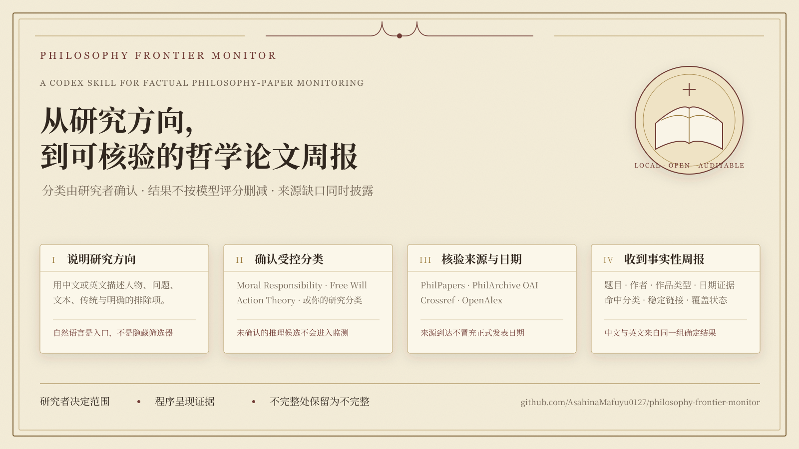
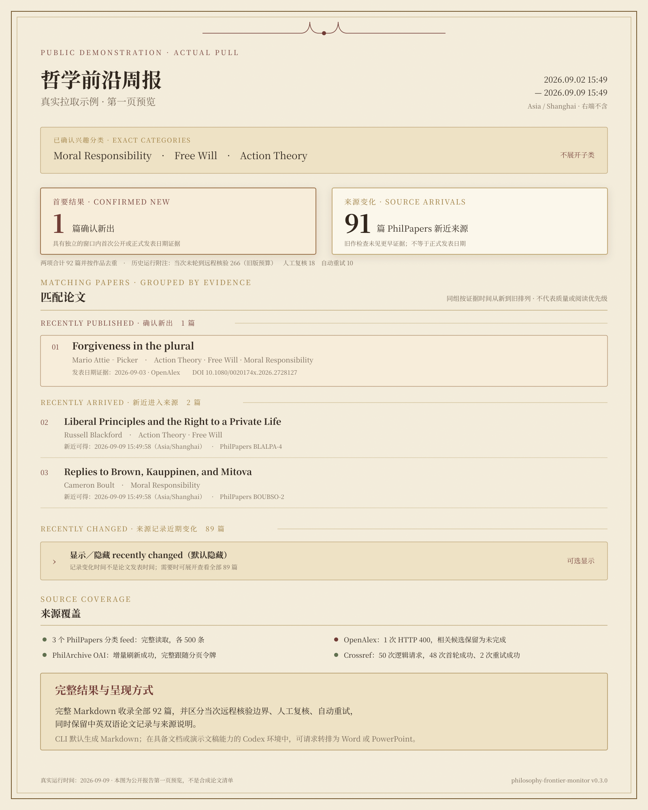

# Philosophy Frontier Monitor

English | [简体中文](README.md)

**Factual weekly philosophy-paper monitoring, organized around the research areas you confirm.**

A researcher describes an area in ordinary Chinese or English. The Skill maps that description to
verified PhilPapers taxonomy categories and activates only the categories the researcher confirms.
Reports preserve titles, authors, date evidence, matched categories, source links, and coverage
gaps. They do not rank paper quality or filter results by a model score.



[Read the complete public sample report](examples/public-demo-weekly-report.md) ·
[Open the report-preview image](assets/demo/public-demo-weekly-report-2026-09-09.png) ·
[Read the full installation guide](references/installation.en.md)

### Public example: an actual pull from three real categories

The report below is not a synthetic mock-up. On 9 September 2026, the project actually ran a
seven-day `pull-now` using `Moral Responsibility` (4590), `Free Will` (347), and `Action Theory`
(5992) from the complete PhilPapers taxonomy. Each category was monitored exactly as selected;
descendants were not added. The example uses the read-only on-demand mode—which shares the weekly
evidence rules—so that it does not pretend a scheduled run occurred or alter formal weekly state.

The primary result of the actual run was **1 confirmed-new paper**, plus **91 recent PhilPapers
source arrivals**. The latter entered the PhilPapers or PhilArchive source-change set for the
selected categories, and that run's old-work check found no earlier work evidence; this is not a
claim that a formal publication date was obtained. Together they make 92 deduplicated works.
The matching-paper block is now divided into **recently published** (1), **recently arrived** (2),
and **recently changed** (89), in that order. Each group is ordered newest first by the evidence
appropriate to its meaning and separated by a rule. Recently changed is collapsed by default, but
the report always leaves a visible show/hide control.

Coverage qualifications remain visible without leading the page. This historical example predates
the date-evidence-insufficient set: 266 candidates did not reach remote verification under that
run's older per-item budget. This describes one run boundary, not a persistent 266-item backlog.
The current version places qualifying fully undated records in the separate private hashed set, so
they do not repeatedly enter this count. That historical run also had 18 human-review cases and 10
automatic-retry cases. One OpenAlex HTTP 400 remains visible in source coverage, so the example does
not claim complete coverage. The image shows page one: the confirmed publication and two source
arrivals appear first, followed by the collapsed record-change group; source coverage immediately
follows the complete matching-paper block. The
[complete Markdown report](examples/public-demo-weekly-report.md) contains all 92 papers, source
status, unfinished-verification disclosures, and Chinese and English sections generated from the
same result set.



The CLI's native report format is Markdown. In a Codex environment with document or presentation
generation capabilities, a user may also ask Codex to typeset the same report as **Word (.docx)**
or **PowerPoint (.pptx)**. That is a post-report presentation conversion: it does not re-filter the
papers, and it is not a native `pfm` CLI export format.
In interactive Markdown, the record-change group can be expanded directly. Before conversion to
Word or PowerPoint, add `--show-recently-changed` when that group should be expanded in the source
report.

### What makes it different

- **You control the scope:** natural-language interests become real, reviewable categories before
  anything is monitored.
- **Complete reporting rather than quality ranking:** author reputation, journal prestige,
  citation counts, and model judgements do not remove results.
- **Evidence and gaps appear together:** the report distinguishes publication, recent
  availability, source re-entry, and metadata updates, and does not disguise source failures as
  zero results.
- **Private configuration stays local:** research interests, credentials, SQLite state, caches,
  and reports are excluded from the public repository by default.

### Start installation

You need Codex, Git, [`uv`](https://docs.astral.sh/uv/), and Python 3.12 or 3.13. In Codex, invoke:

```text
$skill-installer Install the Skill from the repository root at
https://github.com/AsahinaMafuyu0127/philosophy-frontier-monitor;
use path . and the install name philosophy-frontier-monitor.
```

Then, in a new conversation, ask:

```text
Use $philosophy-frontier-monitor to map my research interests to verified PhilPapers categories.
Let me confirm the categories, then guide me through local setup, the historical baseline, and my
first weekly report. Do not ask me to paste credentials into the conversation.
```

The current application release is **v0.3.0**; the internal evidence-pipeline version is **0.6.0**.
Formal real-machine acceptance has been completed on Windows. macOS and Linux paths are supported,
but have not yet received equivalent real scheduled-run validation.

## Technical update: recoverable OAI caching and stable on-demand pulls

Evidence pipeline `0.6.0` adds a recoverable cross-run SQLite cache for PhilArchive OAI harvesting.
`pull-now`, `weekly-run`, and `catch-up` reuse completely harvested windows and request only uncovered
intervals. `--no-oai-cache` temporarily disables this behavior. The private, Git-ignored
`var/oai-cache.sqlite3` remains separate from weekly notifications, baselines, and checkpoints.

The cache stores only record identifiers, source `datestamp` values, deletion markers, the
`dc:identifier`, `dc:date`, and `dc:type` fields used by the program, and opaque pagination state
needed for interruption recovery. It does not store titles, authors, abstracts, full text, or full
OAI responses. A cache hit still reruns exact-window filtering, work-type handling, and the
confirmed-category intersection.

Each successfully parsed OAI page and its successor `resumptionToken` are committed in one SQLite
transaction. An interrupted run resumes from the latest successful page. Coverage is registered
only after the complete sequence is atomically promoted into the formal cache. An expired token or
an upstream `badResumptionToken` response restarts only that original gap.

`pull-now` is stable as of `v0.3.0`, but it remains an explicit, read-only, non-scheduled operation.
It uses the same evidence rules as weekly monitoring and never advances weekly notification
history. Stability means bounded requests, recoverable interruption, state isolation, and honest
coverage reporting; it does not promise a fixed runtime.

## 1. What problem does this solve?

Philosophy researchers often have to revisit PhilPapers, journal pages, and bibliographic databases
to see whether new work has appeared in their fields. This project turns that repetitive work into
a persistent monitor. The researcher describes an area in ordinary Chinese or English; the Skill
maps that description to verified PhilPapers taxonomy categories and reports new papers whose
verified categories intersect the user's confirmed set.

The project does not evaluate argumentative success, rank paper quality, or filter by author
reputation, journal prestige, citation count, or model score. Its purpose is to reduce missed
relevant papers, not to decide what the researcher ought to read.

## 2. Features

Stable `v0.3.0` capabilities include:

- mapping natural-language interests to reviewable PhilPapers categories;
- activating only real categories explicitly confirmed by the user;
- establishing a historical baseline without flooding the first report with existing records;
- running weekly windows in the user's timezone and catching up missed windows chronologically;
- distinguishing formal publication, newly available manuscripts or preprints, source re-entry,
  and metadata updates;
- merging the same work across category feeds and suppressing duplicate weekly notifications;
- reporting title, authors, venue, date evidence, matched categories, sources, and stable links;
- reporting true zero results and explicit source-coverage failures;
- pulling a rolling window of 1–31 local days on explicit request;
- resuming interrupted OAI pagination from a durable checkpoint; and
- producing Chinese and English versions in every weekly and on-demand Markdown report.

The core rule is:

```text
(confirmed new within the window OR confirmed recent arrival in the PhilPapers alert stream)
AND
(verified paper category IDs intersect the user's confirmed interest category IDs)
```

PhilPapers category feeds, PhilArchive OAI record changes, Crossref and OpenAlex bibliographic
evidence, structured work types, and the confirmed category set play distinct roles. An OAI header
`datestamp` means that the source metadata record was created, modified, or deleted. It is not the
paper's publication date.

Records lacking both a feed timestamp and a bibliographic year continue through on-demand
verification only when a successful OAI window supplies positive record-change evidence. A miss is
not a permanent old-work judgment. OAI stock records that have no feed timestamp, bibliographic
year, DOI, or explicit manuscript/preprint type enter a private, source-ID-hash-only
date-evidence-insufficient set. Ordinary pulls disclose its count but spend no per-item lookup
budget on it and do not include it in the per-run remote-verification deferral count or human
review. A later signal automatically reactivates the record. This is not an old-work or relevance judgment, and a genuinely new
manuscript lacking every listed signal may be absent from an ordinary on-demand report. If OAI
fails, the wider candidate set is restored and the coverage degradation is reported. The project
does not extend to paywalled or per-record PhilPapers scraping merely to pursue these records.

Before network access, the CLI warns that a first pull may take longer. The default individual
fallback budget is 300 candidates, intended to finish the non-quarantined candidates in the known
three-category workload in one run. The 1,000-candidate safety limit still applies; this is not an
unbounded completion promise for every possible profile. Under those limits the conservative plan
allows at most 470 OpenAlex and 300 Crossref logical requests before bounded retry attempts, while
cache hits and batch matches normally reduce the actual total.

### Cache storage advice

An initial OAI cache can grow substantially when an upstream source performs a bulk metadata
update. On Windows, if another spacious local drive is available, avoid placing
`storage.state_database` and its adjacent caches on a space-constrained `C:` system drive. Prefer a
spacious non-system drive. The Skill and CLI issue this advice before `pull-now`; they do not move
existing private files without authorization.

Inspect the cache without exposing its token:

```powershell
.\.venv\Scripts\pfm.exe oai-cache status --config config\watchlist.yaml
```

Remove rebuildable cache material older than an explicit cutoff:

```powershell
.\.venv\Scripts\pfm.exe oai-cache prune `
  --config config\watchlist.yaml `
  --before 2026-09-01T00:00:00Z `
  --confirm
```

Pruning does not modify the weekly state database, baseline, checkpoints, or notification history,
and it is refused while a harvest is active.

## 3. Installation and first use

Requirements are Codex, Git, [`uv`](https://docs.astral.sh/uv/), Python 3.12 or 3.13, and network
access to the configured scholarly sources. Production unattended validation has been performed on
Windows. macOS and Linux path semantics are supported, but `v0.3.0` does not claim equivalent
unattended scheduling validation on those platforms.

Ask Codex's built-in installer to install the repository root as the Skill:

```text
$skill-installer Install the Skill from
https://github.com/AsahinaMafuyu0127/philosophy-frontier-monitor.
Use repository path . and installation name philosophy-frontier-monitor.
```

In the installed directory:

```powershell
uv sync --python 3.12
Copy-Item .\config\watchlist.example.yaml .\config\watchlist.yaml
.\.venv\Scripts\pfm.exe doctor
```

The executable is `.venv/bin/pfm` on macOS and Linux. Then:

1. Describe the research direction in ordinary language.
2. Review the proposed verified categories and accept, reject, or defer each one.
3. Obtain the PhilPapers API ID and API key needed for the full taxonomy, keeping both only in a
   private Git-ignored local location or process environment.
4. Establish the historical baseline.
5. Complete a dry run and a production weekly run before creating a recurring schedule.

The default schedule is Monday at 08:00 in the user's local timezone and can be changed. Never paste
API keys, passwords, cookies, or recovery codes into a conversation, issue, screenshot, or command
line argument.

See [Installation and first deployment](references/installation.en.md) and the
[English user guide](references/usage.en.md). The Chinese installation guide is
[安装与首次部署](references/installation.md).

## 4. Current version

Current version: `v0.3.0`.

| Capability | Status |
|---|---|
| Natural-language interests to controlled categories | Stable |
| Scope estimation and user confirmation | Stable |
| Historical baseline | Stable |
| Weekly incremental monitoring and factual reporting | Stable |
| Chronological missed-window catch-up | Stable |
| SQLite state, deduplication, and transactional checkpoints | Stable |
| Bounded source retries, telemetry, and run-level circuit breaking | Stable |
| User-requested `pull-now` | Stable, explicit and read-only |
| OAI cross-run caching, interruption recovery, and incremental refresh | Stable |
| Chinese and English weekly/on-demand report output | Stable |

The OAI cache is a performance and recoverability mechanism, not a substitute for paper-freshness
evidence. Persistence does not turn a source `datestamp` into a publication date and does not bypass
interest categories, work identity, supported work type, or window checks.

The OAI candidate approach was inspired by the `list_recent` operation in
[`sea9401/philosophy-mcp`](https://github.com/sea9401/philosophy-mcp). This project does not copy its
code or retain a first-page-only implementation. It adds complete token pagination, overlap and
exact local filtering, deletions, date-semantic separation, deterministic `/rec/` intersection,
old-work checks, failure fallback, cross-run caching, and interruption recovery. See the Chinese
[design lineage and implementation differences](references/design-lineage.md) for pinned upstream
revisions, licensing, and the detailed comparison.

## 5. Security and source boundaries

- Private interests, confirmed categories, credentials, SQLite state, caches, and reports remain
  local by default and are excluded from the public repository.
- `config/watchlist.yaml`, `var/`, `reports/`, `.env`, and virtual environments are Git-ignored.
- The OAI cache stores minimal record evidence and an opaque recovery token, but no titles, authors,
  abstracts, full text, or complete XML. Status output never reveals the token.
- API keys are read only from private files or the process environment and must not enter code,
  reports, logs, fixtures, URLs, or issues.
- Remote titles, abstracts, XML, JSON, and error pages are untrusted data, never local commands.
- The project does not download paper full text by default or bypass paywalls, access controls, TLS,
  or site protections.
- Crossref and OpenAlex support identity, old-work, and date checks. Absence or temporary failure is
  not presented as a certain conclusion.
- The MIT License covers this project's code, not third-party taxonomy data, metadata, abstracts,
  or papers.

See the Chinese source-of-truth policies for
[security and privacy](references/security-and-privacy.md),
[monitoring](references/monitoring-policy.md),
[date and version semantics](references/date-and-version-semantics.md), and
[third-party notices](THIRD_PARTY_NOTICES.md).

## 6. Feedback

- Maintainer: **Asahina Mafuyu**
- Contact: [junxuanxie@stu.xjtu.edu.cn](mailto:junxuanxie@stu.xjtu.edu.cn)

Use [GitHub Issues](https://github.com/AsahinaMafuyu0127/philosophy-frontier-monitor/issues) for
ordinary installation problems, reproducible bugs, source-compatibility changes, and enhancement
proposals. Include the version, operating system, command, window length, redacted error summary,
and count-only `oai-cache status` fields when relevant. Do not attach credentials, private interests,
the complete watchlist, databases, reports, authenticated URLs, or a resumption token.

Do not disclose a vulnerability that could expose credentials or private research data in a public
issue. Use GitHub Private Vulnerability Reporting as described in [SECURITY.md](SECURITY.md).
