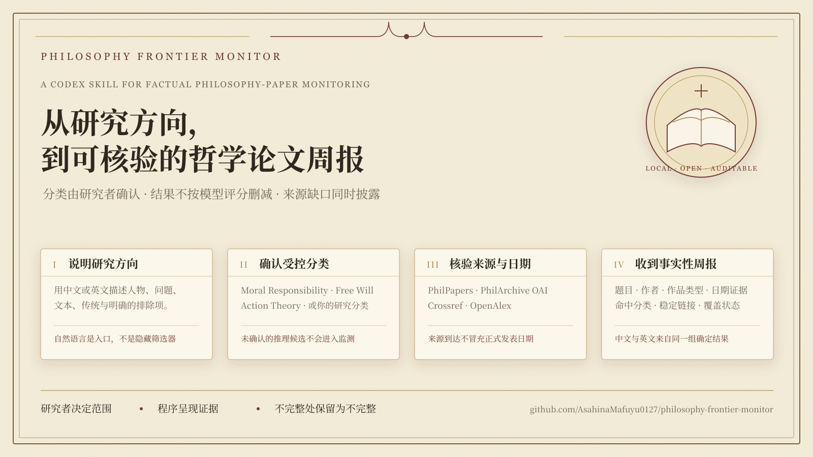
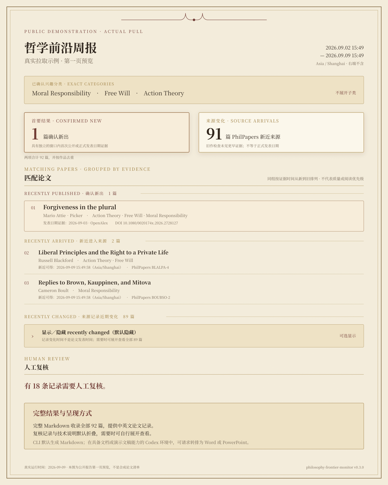

# Philosophy Frontier Monitor

Search existing papers from confirmed interests with `pfm search --config config/watchlist.yaml`.
Historical search has no recent-publication gate and accepts supported paper forms only; books,
chapters and book reviews are excluded. Available OpenAlex citation counts sort descending, with
missing values labelled and placed last. Temporary active-category selection, year/type filters,
and result pagination do not change subscriptions or weekly state. Coverage is the current category
feed inventory, not the complete historical index. Without year bounds, all verified matches are
returned by default, including undated feed records. Only year-bounded searches exclude records
without feed year hints; an explicit result limit still enables pagination.
See the [search contract](references/paper-search.md).

English | [简体中文](README.md)

**Factual weekly philosophy-paper monitoring, organized around the research areas you confirm.**

A researcher describes an area in ordinary Chinese or English. The Skill maps that description to
verified PhilPapers taxonomy categories and activates only the categories the researcher confirms.
Reports preserve titles, authors, date evidence, matched categories, source links, and coverage
gaps. They do not rank paper quality or filter results by a model score.



[Read the complete public sample report](examples/public-demo-weekly-report.md) ·
[Open the report-preview image](assets/demo/public-demo-weekly-report-2026-09-09.png) ·
[Read the full installation guide](references/installation.en.md)

### Public example: an actual pull from three real categories

The report below is not a synthetic mock-up. On 9 September 2026, the project actually ran a
seven-day `pull-now` using `Moral Responsibility` (4590), `Free Will` (347), and `Action Theory`
(5992) from the complete PhilPapers taxonomy. Each category was monitored exactly as selected;
descendants were not added. The example uses the read-only on-demand mode—which shares the weekly
evidence rules—so that it does not pretend a scheduled run occurred or alter formal weekly state.

The primary result of the actual run was **1 confirmed-new paper**, plus **91 recent PhilPapers
source arrivals**. The latter entered the PhilPapers or PhilArchive source-change set for the
selected categories, and that run's old-work check found no earlier work evidence; this is not a
claim that a formal publication date was obtained. Together they make 92 deduplicated works.
The matching-paper block is now divided into **recently published** (1), **recently arrived** (2),
and **recently changed** (89), in that order. Each group is ordered newest first by the evidence
appropriate to its meaning and separated by a rule. Recently changed is collapsed by default, but
the report always leaves a visible show/hide control.

An additional **18 records require human review**.

The image shows the report's first page. The
[complete Markdown report](examples/public-demo-weekly-report.md) contains all 92 papers in Chinese
and English. Review records and technical notes can be expanded there if the reader wants details.



The CLI's native report format is Markdown. In a Codex environment with document or presentation
generation capabilities, a user may also ask Codex to typeset the same report as **Word (.docx)**
or **PowerPoint (.pptx)**. That is a post-report presentation conversion: it does not re-filter the
papers, and it is not a native `pfm` CLI export format.
In interactive Markdown, the record-change group can be expanded directly. Before conversion to
Word or PowerPoint, add `--show-recently-changed` when that group should be expanded in the source
report.

### What makes it different

- **You control the scope:** natural-language interests become real, reviewable categories before
  anything is monitored.
- **Complete reporting rather than quality ranking:** author reputation, journal prestige,
  citation counts, and model judgements do not remove results.
- **Evidence and gaps appear together:** the report distinguishes publication, recent
  availability, source re-entry, and metadata updates, and does not disguise source failures as
  zero results.
- **Private configuration stays local:** research interests, credentials, SQLite state, caches,
  and reports are excluded from the public repository by default.

### Start installation

You need Codex, Git, [`uv`](https://docs.astral.sh/uv/), and Python 3.12 or 3.13. In Codex, invoke:

```text
$skill-installer Install the Skill from the repository root at
https://github.com/AsahinaMafuyu0127/philosophy-frontier-monitor;
use path . and the install name philosophy-frontier-monitor.
```

Then, in a new conversation, ask:

```text
Use $philosophy-frontier-monitor to map my research interests to verified PhilPapers categories.
Let me confirm the categories, then guide me through local setup, the historical baseline, and my
first weekly report. Do not ask me to paste credentials into the conversation.
```

The latest tagged application release is **v0.4.0**; the internal evidence-pipeline version remains **0.6.0**.
Formal real-machine acceptance has been completed on Windows. macOS and Linux paths are supported,
but have not yet received equivalent real scheduled-run validation.

<a id="technical-update-2026-10-08-v040-release"></a>

## Technical update: v0.4.0 release (2026-10-08)

This release includes the
[accepted bounded Chinese-journal leads workflow](references/chinese-journal-stabilization.md),
shared publisher-date corroboration across the three modes, and corrections to
weekly source status and deduplication coverage in `v0.4.0`.
The application metadata and `uv.lock` agree; the internal evidence pipeline
stays at `0.6.0`. Chinese records remain separately labelled leads. Weekly and
on-demand reports list them only when a supported publication month overlaps
the relevant window.

Confirmed newly published Chinese papers, fully automated coverage of all 15
registered journals, complete database recall, and a fixed indexing delay are
outside this release scope. Opening a public `v0.3.0` schema-4 state database
with this schema-6 release first creates an integrity-checked backup; see
the [upgrade guide](references/installation.en.md#upgrade-checks-for-v040).

The release audit now excludes the `.git` pointer file used by linked worktrees.
All 422 tests, Ruff, skill validation, the read-only release audit, and locked
dependency installation passed. The required source-package files and private-path
exclusions were checked; the wheel installed in a fresh environment and its command
entrypoints worked. See the [release checks](references/v0.4-release-candidate.md).
This update corresponds to the `v0.4.0` tag and GitHub Release.
<a id="technical-update-2026-10-07-weekly-coverage"></a>

## Technical update: weekly source status and deduplication coverage (2026-10-07)

Weekly reports now distinguish `local_only` reviewed publisher issues from source failures.
When checked network sources succeed and the local publisher-issue store has no newly reviewed
issue, the report no longer claims that a source check failed. CNKI and Wanfang coverage now
states how many eligible issue or article leads were listed previously, reconciling the candidate
total with missing months, outside-window leads, and the current report. Previously listed leads
remain deduplicated. Text corrections to an already successful report retain a private original
and do not rerun its window or advance checkpoints. All 420 tests, Ruff, skill validation, and
the read-only release audit passed. This is a local code and documentation update, without a push,
version tag, or GitHub Release.

<a id="technical-update-2026-09-28-weekly-months"></a>

## Technical update: shared Chinese-journal dates and weekly section order (2026-09-28)

Both complete language versions of weekly reports now list Chinese publisher, CNKI, and Wanfang
leads before PhilPapers papers. The first CNKI baseline also applies the publication-month gate:
only month-supported issues overlapping the weekly window display article titles. Earlier issues,
missing months, and conflicting dates remain in coverage counts. Issue numbers, query dates, and
announcement dates cannot supply a publication month. Announcement-only publisher issues are
withheld from weekly reports; explicit issue labels and an earlier release day remain separate facts.

When CNKI lacks dates, `scripts/prepare_weekly_cnki.py --config config/watchlist.yaml` produces a
bounded, read-only candidate list for review against the publisher's same-article or same-issue page.
Weekly preparation remains the default; `--mode pull-now --days N` and
`--mode search --year-from YYYY --year-to YYYY` align preparation with the other two modes.
All three modes share the evidence logic and consistent issue/article fields. Search JSON and Markdown
show reviewed dates, publisher links, and missing/conflicting months. Historical candidates still
follow the requested year scope; they are not automatically described as recent papers.
The private reviewed-bibliography file accepts optional `issue_label_month` and `publication_date`
fields. Only fully matching publisher bibliographies can supplement dates; catalog records cannot.
Month filtering precedes article-level Wanfang checks. A previously undated observation can become
eligible after corroboration, and an older catch-up window cannot consume a future issue early.
Previously eligible issues remain deduplicated. See the
[Chinese-source policy](references/chinese-source-expansion.md#43-月份精度与新期次观察).

All 419 tests and Ruff passed, covering first-scan filtering, earlier and undated exclusions,
bibliographic conflicts, invalid dates, early publication, later corroboration, future-window
eligibility, both language orders, shared evidence across search and immediate results, year scopes,
and read-only weekly state. The program consumes manually verified dates; the preparation
script does not automatically interpret publisher dates, confirm first publication within the week,
or establish interest-category membership. This is a local code and documentation update, without
a push, version tag, or GitHub Release.

<a id="technical-update-2026-09-28-journal-p2"></a>

## Technical update: ninth publisher TOC and stricter arrival evidence (2026-09-28)

Stability decision: the [Chinese-journal acceptance criteria](references/chinese-journal-stabilization.md) are met for the **bounded Chinese leads service**. This `main` branch update treats it as a stable opt-in capability: `search` returns sourced Chinese metadata candidates, `pull-now` displays only leads with an explicit issue month overlapping its recent window, and `weekly-run` baselines and deduplicates reviewed new issues while disclosing source failures. Automatically collected publisher TOCs still need human evidence review before entering those modes; candidates do not become confirmed newly published papers. The public example leaves Chinese sources off. This contract does not promise comprehensive coverage, a fixed database arrival time, or an interest-paper recall rate. This code push does not create a version tag or GitHub Release.

Bounded collection now includes the [*Confucius Studies* publisher category](https://www.chinakongzi.org/category/kongziyanjiu_qikan/). It reads only the index and the latest [official issue page](https://www.chinakongzi.org/content/6147_589032.html), checking the issue number, 15 author-title entries, and corresponding article headings later on that page. The page's 2026-08-13 date is an announcement day retained as pending evidence. It does not explicitly label the issue month, so issue 4 cannot be converted into an August issue or evidence that its papers were first published in August. Nine of the fifteen registered journals now have independently scannable TOCs (eight textual, one PDF); six still require site-specific manual checks.

Same-article arrival summaries now use a `miss` as the last complete non-hit only when its query scope was saved and marked complete. Older misses without that scope and truncated queries cannot create a falsely precise arrival interval; their original observation rows remain intact. The issue-level `audit` adds `complete_misses` to separate complete non-hits from raw status counts. The [article observation protocol](references/publisher-article-observation.md) explains this accounting and the remaining source limits.

The P2 issue audit now has separate denominators for complete publisher TOC records, manually confirmed research articles, and manually confirmed interest-relevant articles. The narrower denominator stays unknown while any type or interest decision is unreviewed or uncertain. A source-specific research visibility denominator requires a scoped, complete query for every confirmed research article in that issue. `journal-watch catalog` now marks each TOC as `automatic` or `manual`. A [site-by-site review of the six remaining journals](references/publisher-article-observation.md#2026-09-28-六站入口复核与自动采集决定) records their official evidence and re-entry conditions. *Social Sciences in China* has issue pages and an issue 8 official WeChat TOC pointer, but direct access and source-use conditions do not yet support automatic collection here; *Ethics Studies* returns 502, *Religious Studies* has image TOCs, and the other three registered entries lack current complete publisher TOCs. They remain available for manual review; absence from automated collection is not evidence of no new issue. The [source-use notice](THIRD_PARTY_NOTICES.md#中文期刊发布渠道及补充检索) now states access, cadence, retained fields, and public-display limits; Wanfang remains off by default.

On 28 September 2026, a new Git-ignored isolated database scanned one issue from each of nine journals: 132 TOC records, no site failures, and no article-database queries in the default cycle. The first bounded check matched one *Confucius Studies* article on the public CNKI surface. An explicit Wanfang Query check in a separate isolated copy compared a second article: CNKI matched and Wanfang did not, each after a complete one-page query. The publisher's space inside that author's Chinese name had caused a false review status; it is now parsed correctly and covered by a regression test. Only two articles from this issue were checked; the other 13 and all articles from the other journals remain unchecked in this round. Wanfang stays off by default. This sample cannot establish database-wide recall, database-wide omission, or a fixed indexing time. All 402 tests, Ruff, Skill validation, and the read-only release audit passed. This is a `main` branch code and documentation update, without a new tag or GitHub Release.

<a id="technical-update-2026-09-27-journal-p2"></a>

## Technical update: issue-level denominators and an eighth publisher directory (2026-09-27)

Building on the accepted P0/P1 Chinese-leads workflow, `pfm journal-watch audit` now gives an issue-level reference denominator only when a complete publisher TOC scan passed the site's page and entry checks and its saved title set still matches that scan. Older and truncated records keep an unknown denominator. The article view records each latest check on public CNKI search or the optional Wanfang Query, including its actual query scope and pages fetched. `classify` lets a reviewer use the registered publisher link to assess work type and local research relevance separately. Unreviewed entries are not counted as research papers or interest matches. This local audit does not promote entries into the verified-paper sections of search, pull-now, or weekly reports.

An eighth publisher source joins the seven textual TOCs: bounded parsing of the [*Modern Philosophy* directory at Sun Yat-sen University](https://mphilosophy.sysu.edu.cn/cat/124). Its [2026 issue 2 announcement](https://mphilosophy.sysu.edu.cn/article/25746) is dated 29 June, while the attached Chinese TOC PDF explicitly calls it the March issue. The system keeps the issue month and announcement day as two distinct pending evidence links; it does not treat the announcement as first publication of each article. PDF reads are limited to the registered HTTPS host, size and page bounds, content type, file header, and an issue-entry count check. Parsing is in memory; the PDF itself is not stored. Seven other registered publishers still need site-specific manual review.

In a Git-ignored isolated database on 27 September 2026, one complete issue from each of eight journals yielded 117 publisher TOC records. Directory-only scans made no database queries. Eight separate bounded title searches, one per journal, all matched on the public CNKI search surface. The other 109 entries were not checked in that round; Wanfang remained off, and no article-level work-type or interest review was completed. This is not a database-wide recall or arrival-time estimate. All 398 tests, Ruff, Skill validation, and the read-only release audit passed. See the [article observation protocol](references/publisher-article-observation.md) and [stabilization criteria](references/chinese-journal-stabilization.md) for commands, evidence, and use boundaries. This local branch update has not been pushed, tagged, or released.

<a id="technical-update-2026-09-27-official-journals"></a>

## Technical update: publisher TOCs and article arrival observations (2026-09-27)

The P0/P1 work in the [Chinese-journal stabilization criteria](references/chinese-journal-stabilization.md) is now accepted for the bounded leads workflow. Search labels a failed read of the local publisher evidence store and continues. Automatically collected issues appear in `pfm journal-watch pending`; after checking the exact publisher page, `review --confirm-evidence` promotes the observation. Even a parsed announcement date remains pending until source review. First observation and first review times remain separate, later scans cannot revoke a review, and multiple official links for one issue produce one user-facing lead, reported in the week of its earliest review. Isolated three-mode tests cover enablement, disabled sources, rolling-month selection, weekly baseline, and deduplication. Failure tests cover rate limits, non-HTML responses, redirects, truncated pagination, and site isolation. Fresh isolated database trials found 12 entries in issue 8 of the *Philosophical Research* portal (still pending) and 11 in issue 4 of the [*Zhouyi Studies* publisher directory](https://zhouyi.sdu.edu.cn/info/1033/2558.htm). After checking that the page explicitly states an announcement date of 2026-08-21, only that isolated issue was reviewed. The date does not establish first publication of any article. Chinese metadata candidates remain separate from matched papers; article-level verification and full Chinese-journal coverage remain unfinished. This is an unpushed local branch update, without a new tag or release.

Final checks passed: 391 tests, Ruff, skill validation, and the read-only release audit. The live source trial covered only the two sites above; it does not establish sustained access across all seven collectors or recall of all Chinese philosophy papers.

The [Chinese-source policy](references/chinese-source-expansion.md) now corrects an older statement that the *Philosophical Trends* portal stopped at issue 7 and publisher TOCs were still entirely manual. The seven-site collection saw issue 8; the user-supplied issue 9 WeChat post remains unread and pending. This correction does not promote collected TOCs to reviewed papers.

The new [Chinese-journal stabilization criteria](references/chinese-journal-stabilization.md) separate a bounded Chinese-leads service that can be accepted earlier from a verified-new-paper service that still needs article-level evidence. They require fresh-install acceptance of all three modes, a publisher-evidence review path, honest source-failure handling, and scoped coverage samples. The eight-week same-article study supplies source-arrival evidence; it is not the sole stability gate. This remains an unpushed branch update.

Bounded site-specific collectors now read complete textual tables of contents for seven journals: *Journal of Dialectics of Nature*, *Zhouyi Studies*, *Philosophical Research*, *Philosophical Trends*, *Philosophical Analysis*, *Studies in Dialectics of Nature*, and *Studies in Philosophy of Science and Technology*. `pfm journal-watch run` scans all seven sequentially and only scans publisher directories by default. An explicit positive article-check budget checks the public CNKI Space search surface; the subscribed Wanfang Query endpoint additionally requires `--with-wanfang`. Total and per-site article checks are bounded, and one site failure does not stop the others. Observations remain in a Git-ignored local database. Publisher scans provide leads about new issues; repeat checks of the same article are optional source evaluation. Other users can use search, pull-now, or weekly reports without establishing an observation baseline. A complete search miss followed by an identified hit bounds search visibility; an initial hit and continuing misses are censored observations and do not prove database-wide absence.

The seven latest issues yielded 14, 11, 12, 12, 16, 17, and 18 author-bearing TOC entries, 100 in total. The first round checked five entries from each of the original three journals and one from each of the four added journals: all 19 were visible through public CNKI search, while the earlier explicitly enabled exact-title Wanfang queries matched two and did not match 17. These are bounded observations, not a database-wide miss rate. Repeat checks currently have an initial review point at roughly eight weeks; any Wanfang delay study needs a separate explicit opt-in and scope. The *Philosophical Trends* editorial portal still shows issue 8; the user-supplied WeChat link for issue 9 remains a pending lead because its body could not be read. Eight other catalog entries retain site-specific manual review. All 379 tests, Ruff, and the read-only release check passed; no multi-day arrival interval has yet been measured. See the [observation protocol](references/publisher-article-observation.md). This change was not pushed and did not create a version tag or GitHub Release.

## Technical update: publisher-first Chinese journal issue registry (2026-09-27)

Issue discovery and date evidence for monitored Chinese journals now start with
their editors' or publishers' websites, editorial portals, and verified official
WeChat announcements. CNKI Space and Wanfang provide supplementary discovery and
bibliographic crosschecks. A [catalog of 15 journals](config/official-journals.yaml)
and a private Git-ignored SQLite issue store have been added. `pfm journal-watch catalog`
lists channels; `pfm journal-watch list` shows local observations. Manual entries
retain an official evidence URL and separate issue label month, issue publication
date, announcement date, and first observation. Only reviewed entries appear in
search, on-demand, and weekly issue leads. A reviewed official month may fill a
missing CNKI month for the same journal, year, and issue; conflicting source
months are not overwritten.
Weekly reports mention an issue only in its first review week, avoiding repeated
weekly notices for the same monthly issue.

The journal portal calls *Zhexue Dongtai* monthly, but the supplied
[issue 9 WeChat post](https://mp.weixin.qq.com/s/eeYI8s6Y_f9J3zbJ73XgSg) could not be read
in this environment. It remains a pending lead, without an inferred post date
or September issue label. The catalog records the publisher's 2026 schedules
for *Zhexue Yanjiu* (the 25th of each month) and *Shijie Zhexue* (the 2nd of
odd-numbered months), but a schedule
does not establish an actual issue date. The registry still requires manual
review; it does not yet harvest article tables of contents across journals or
verify individual interest matches. Issue leads do not count as confirmed new
papers. Local verification covered the 15-journal catalog, private-store write and read,
368 tests, Ruff, skill validation, and the release audit. Continuous automated
journal checks were not run. This is a
local branch update, with no push, version tag, or GitHub Release. See the
[source and entry policy](references/chinese-source-expansion.md#24-官方期刊监控库与证据录入).

<a id="technical-update-2026-09-27-audit"></a>

## Technical update: journal issue-month audit baseline (2026-09-27)

A private, Git-ignored sample audit now compares journal-hosted issue evidence with
bounded CNKI Space and subscribed Wanfang Query searches, preserving the observation
time. CNKI Space returned all eight sampled articles but none with an explicit month;
Wanfang returned three exact bibliographic matches and one title-suffix variant, while
four had no same-work match in the bounded queries. Two articles from a journal issue
explicitly labelled September would still fail the current CNKI month gate even if
the private discovery terms found them. This audit did not test recall of those terms.
A search miss does
not establish absence from the entire database, and a single snapshot cannot measure
actual indexing delay. A journal's issue date and Wanfang's abstract-online date are
also distinct from an article's first-publication date.

The [source evidence and trial decision](references/chinese-source-expansion.md#23-重点期刊原站目录的月份证据与抽样基线)
document the original journal links, access limits, and date semantics. Broad automated
journal-site intake remains deferred. A small trial using a stable issue page with an
explicit month is the next candidate, followed by repeated observations before expansion.
This branch-only audit and documentation update has no new tag, GitHub Release, or push.

<a id="technical-update-2026-09-23"></a>

## Technical update: independent Wanfang discovery with a personal subscription (2026-09-27)

An optional Wanfang discovery path now queries the subscribed AI HUB Query endpoint for
Chinese journal metadata directly, without requiring a matching CNKI Space hit. It uses
private Chinese terms and explicit term, year, and page limits. Historical search lists
these as separate leads; on-demand pulls show only leads whose source-labelled publication
month overlaps the rolling window; the first weekly scan establishes a baseline for eligible
record IDs, and later reports show IDs not previously listed in that window. A later article in an
already observed issue can therefore appear as a new observation. Set
`sources.wanfang.discover: true` in the private watchlist to opt in. The default is two
terms and one page per term and year; calls can consume personal trial quota. See the
[Chinese-source expansion note](references/chinese-source-expansion.md).

A bounded live trial on 2026-09-27 confirmed year-limited search and publication-date sorting
with the existing subscription. It also found issue 4 labelled January 1 and a publication
label later than the query date. Wanfang's `PublishDate` is therefore kept as source metadata,
not treated as an article's first-publication day; January 1 is rejected as reliable month
evidence. Chinese leads remain separate from verified PhilPapers papers, and blocked or
truncated searches are disclosed. Crossref, DOAJ, and journal-hosted contents can supplement
coverage, but none currently demonstrates complete coverage of Chinese philosophy journals
without a database-wide agreement. New regressions cover independent discovery, placeholder
dates, the on-demand window, and weekly record-ID increments. This branch update has no new
tag or GitHub Release.

## Technical update: CNKI Space leads and Chinese journal issue observations (2026-09-23)

This branch update keeps the long-term target as the **union of global PhilPapers candidates
and supplementary Chinese database candidates**, without filtering existing PhilPapers results
by author affiliation. A private watchlist can now enable `sources.cnki_space` and specify
user-approved Chinese terms and a page limit. The adapter follows the public search method
documented by the third-party [cnki-search MCP](https://github.com/Biogod2020/cnki-search),
using an ordinary HTTP client rather than running its server or impersonating a browser.
See the [Chinese-source expansion note](references/chinese-source-expansion.md) for configuration
and evidence rules.

All three modes can now display Chinese-source leads. `search` lists unverified Chinese
metadata separately from confirmed papers and excludes it from verified totals and citation
sorting. `pull-now` reads only issue leads with an explicit source-labelled month overlapping
its rolling window, without changing weekly state. The first weekly scan
establishes an issue baseline; later reports list only issue keys not previously observed,
committing those observations with the weekly run. Reports preserve source year, issue number,
and first-observation time. Issue 9 is not automatically a September issue, and a day shown
in search metadata is not automatically a paper's first publication date. Blocking, changed
HTML, and page-limit truncation appear as coverage limits rather than zero results.

A minimal redistributable HTML fixture now tests parsing, error pages, content types, page
interruption, and transactional state. A bounded public search was also run using terms held
only in the private watchlist. Systematic journal-site, Wanfang, and VIP record checks, publication-time
author affiliations, and cross-source paper identity still require article-level review beyond
the manually checked candidates described below. CNKI Space is not
the full KNS collection, and bounded pages cannot establish complete Chinese or worldwide
coverage. No new version tag or GitHub Release was created.

A Git-ignored private evidence file now records article-level manual checks against journal
or catalog pages. It marks title, authors, journal, year, and issue corroborated only when
the fields agree, and notes China-based author affiliation only when the article page
supports it. Two private candidates have been checked against a journal publication portal page
and a separate catalog page; only the journal article page supports the affiliation note.
The publication portal is hosted by CNKI, so this does not constitute an independent
Wanfang or VIP check.
Search and reports can also flag strict bibliographic overlap with PhilPapers records
resolved in the current run, without merging records or changing verified paper totals.
Synthetic tests cover agreement, conflicts, missing fields, and overlap. The National
Center for Philosophy and Social Sciences Documentation restricts unlicensed automated
crawling in its user agreement; broad Wanfang coverage and VIP access remain pending.
The [Chinese-source expansion note](references/chinese-source-expansion.md) describes the
private file and its evidence limits.

An optional Wanfang AI HUB metadata cross-check now uses the subscribed Query
endpoint for a bounded set of CNKI leads. When enabled, it reads the AppKey from
`WFDATA_APP_KEY` or a configured Git-ignored local file and compares Chinese journal title, authors,
journal, year, and issue. Search, on-demand pulls, and weekly reports distinguish
agreement, missing fields, conflict, and no corroboration in the checked scope.
`OriginalOrganization` is retained as a publication-time affiliation lead, but
the program does not automatically assign a China-based affiliation to an author.
The absence of a same-title hit does not prove that Wanfang lacks the article. Synthetic JSON tests cover
the request, response variants, errors, and pagination limits. A bounded live
trial using the subscribed API and CNKI leads confirmed authentication and the
actual response shape: `numFound` can be a decimal string, journal metadata can
appear in `Periodical`, and `PublishYear` can be zero while `PublishDate` has a
year. The parser now handles these cases. Private search results and the AppKey
remain outside public files; trial quota, long-term stability, and full coverage
remain unverified.

This branch update also narrows the Chinese section of an on-demand pull as requested:
it no longer lists every issue found in the current year. A lead appears only
when the source explicitly labels an issue month overlapping the selected rolling
window. Year-only and issue-number-only leads, and months outside the window,
contribute to coverage counts without listing their article titles. On-demand
Wanfang checks are limited to the displayed leads. Month precision cannot prove
an article's first publication day, and an empty Chinese section does not establish
that no recent Chinese paper exists; the researcher may request a broader search.
Historical `search` and formal weekly monitoring retain their existing scope.
Synthetic tests cover overlapping months, missing months, and out-of-window issues.
No new version tag or GitHub Release was created.

<a id="technical-update-2026-09-20"></a>

## Technical update: human-review notice in the public example (2026-09-20)

The public example's coverage note now states only that 18 records require human review. Both
README pages and the preview image reflect this change. Review details and technical notes in the
full example are collapsed by default and can be expanded voluntarily; the original paper records
and verification facts are preserved. This documentation and presentation update includes checks
of paper content, collapsible sections, and links, plus a rendered-image review.

<a id="technical-update-2026-09-19"></a>

## Technical update: interest-based paper search and local-time scheduling (2026-09-19)

This `main` branch update adds the independent `pfm search` command. It searches existing papers
using confirmed interests and PhilPapers feed membership, with any/all tag matching and optional
year and paper-type filters. Search requires no monitoring baseline and does not change subscriptions
or weekly notification history. The feature was pushed in
[commit `9249da6`](https://github.com/AsahinaMafuyu0127/philosophy-frontier-monitor/commit/9249da600c79a63c2f55a973bcd98c60cd2361dd);
no separate version tag or GitHub Release has been created for it.

**Without year bounds**, missing feed dates, year hints, or publication dates do not exclude a
verified paper, and all verified matches are returned by default. Explicit result limits still
enable pagination. **With year bounds**, records without feed year hints are excluded before
bibliographic lookup; the final year filter uses bibliographic publication-date evidence.

Available OpenAlex citation counts sort descending, with missing values labelled and placed last;
zero remains distinct from missing. Books, chapters, book reviews, and other non-paper forms are
excluded. Reports mention unresolved paper types or bibliographic identities without counts and
may provide existing source links for optional user review. The skill does not launch follow-up
investigations for these records. Conflicting DOI evidence remains unresolved even when an external
lookup returns just one match.

For scheduling, the skill reads the user's timezone from the session or, when absent, the local OS.
An unqualified time such as “8 a.m.” is interpreted locally. The weekday, time, and timezone are
confirmed together at final task creation; existing subscriptions retain their confirmed timezone.

The feature commit passed **319 tests**, lint and formatting checks, skill validation, and the
release audit. Git history bundles are protected as private files. Search coverage remains limited
to papers available and verified from the selected category feeds, not the complete PhilPapers
index. See the [search contract](references/paper-search.md) and [changelog](CHANGELOG.md).

Future project updates must also appear in the technical updates on both README pages, while
preserving earlier entries. This requirement is recorded in the
[contribution rules](CONTRIBUTING.md#网页技术更新与变更记录).

## Technical update: recoverable OAI caching and stable on-demand pulls

Evidence pipeline `0.6.0` adds a recoverable cross-run SQLite cache for PhilArchive OAI harvesting.
`pull-now`, `weekly-run`, and `catch-up` reuse completely harvested windows and request only uncovered
intervals. `--no-oai-cache` temporarily disables this behavior. The private, Git-ignored
`var/oai-cache.sqlite3` remains separate from weekly notifications, baselines, and checkpoints.

The cache stores only record identifiers, source `datestamp` values, deletion markers, the
`dc:identifier`, `dc:date`, and `dc:type` fields used by the program, and opaque pagination state
needed for interruption recovery. It does not store titles, authors, abstracts, full text, or full
OAI responses. A cache hit still reruns exact-window filtering, work-type handling, and the
confirmed-category intersection.

Each successfully parsed OAI page and its successor `resumptionToken` are committed in one SQLite
transaction. An interrupted run resumes from the latest successful page. Coverage is registered
only after the complete sequence is atomically promoted into the formal cache. An expired token or
an upstream `badResumptionToken` response restarts only that original gap.

`pull-now` is stable as of `v0.3.0`, but it remains an explicit, read-only, non-scheduled operation.
It uses the same evidence rules as weekly monitoring and never advances weekly notification
history. Stability means bounded requests, recoverable interruption, state isolation, and honest
coverage reporting; it does not promise a fixed runtime.

## 1. What problem does this solve?

Philosophy researchers often have to revisit PhilPapers, journal pages, and bibliographic databases
to see whether new work has appeared in their fields. This project turns that repetitive work into
a persistent monitor. The researcher describes an area in ordinary Chinese or English; the Skill
maps that description to verified PhilPapers taxonomy categories and reports new papers whose
verified categories intersect the user's confirmed set.

The project does not evaluate argumentative success, rank paper quality, or filter by author
reputation, journal prestige, citation count, or model score. Its purpose is to reduce missed
relevant papers, not to decide what the researcher ought to read.

## 2. Features

Stable `v0.3.0` capabilities include:

- mapping natural-language interests to reviewable PhilPapers categories;
- activating only real categories explicitly confirmed by the user;
- establishing a historical baseline without flooding the first report with existing records;
- running weekly windows in the user's timezone and catching up missed windows chronologically;
- distinguishing formal publication, newly available manuscripts or preprints, source re-entry,
  and metadata updates;
- merging the same work across category feeds and suppressing duplicate weekly notifications;
- reporting title, authors, venue, date evidence, matched categories, sources, and stable links;
- reporting true zero results and explicit source-coverage failures;
- pulling a rolling window of 1–31 local days on explicit request;
- resuming interrupted OAI pagination from a durable checkpoint; and
- producing Chinese and English versions in every weekly and on-demand Markdown report.

The core rule is:

```text
(confirmed new within the window OR confirmed recent arrival in the PhilPapers alert stream)
AND
(verified paper category IDs intersect the user's confirmed interest category IDs)
```

PhilPapers category feeds, PhilArchive OAI record changes, Crossref and OpenAlex bibliographic
evidence, structured work types, and the confirmed category set play distinct roles. An OAI header
`datestamp` means that the source metadata record was created, modified, or deleted. It is not the
paper's publication date.

Records lacking both a feed timestamp and a bibliographic year continue through on-demand
verification only when a successful OAI window supplies positive record-change evidence. A miss is
not a permanent old-work judgment. OAI stock records that have no feed timestamp, bibliographic
year, DOI, or explicit manuscript/preprint type enter a private, source-ID-hash-only
date-evidence-insufficient set. Ordinary pulls disclose its count but spend no per-item lookup
budget on it and do not include it in the per-run remote-verification deferral count or human
review. A later signal automatically reactivates the record. This is not an old-work or relevance judgment, and a genuinely new
manuscript lacking every listed signal may be absent from an ordinary on-demand report. If OAI
fails, the wider candidate set is restored and the coverage degradation is reported. The project
does not extend to paywalled or per-record PhilPapers scraping merely to pursue these records.

Before network access, the CLI warns that a first pull may take longer. The default individual
fallback budget is 300 candidates, intended to finish the non-quarantined candidates in the known
three-category workload in one run. The 1,000-candidate safety limit still applies; this is not an
unbounded completion promise for every possible profile. Under those limits the conservative plan
allows at most 470 OpenAlex and 300 Crossref logical requests before bounded retry attempts, while
cache hits and batch matches normally reduce the actual total.

### Cache storage advice

An initial OAI cache can grow substantially when an upstream source performs a bulk metadata
update. On Windows, if another spacious local drive is available, avoid placing
`storage.state_database` and its adjacent caches on a space-constrained `C:` system drive. Prefer a
spacious non-system drive. The Skill and CLI issue this advice before `pull-now`; they do not move
existing private files without authorization.

Inspect the cache without exposing its token:

```powershell
.\.venv\Scripts\pfm.exe oai-cache status --config config\watchlist.yaml
```

Remove rebuildable cache material older than an explicit cutoff:

```powershell
.\.venv\Scripts\pfm.exe oai-cache prune `
  --config config\watchlist.yaml `
  --before 2026-09-01T00:00:00Z `
  --confirm
```

Pruning does not modify the weekly state database, baseline, checkpoints, or notification history,
and it is refused while a harvest is active.

## 3. Installation and first use

Requirements are Codex, Git, [`uv`](https://docs.astral.sh/uv/), Python 3.12 or 3.13, and network
access to the configured scholarly sources. Production unattended validation has been performed on
Windows. macOS and Linux path semantics are supported, but `v0.3.0` does not claim equivalent
unattended scheduling validation on those platforms.

Ask Codex's built-in installer to install the repository root as the Skill:

```text
$skill-installer Install the Skill from
https://github.com/AsahinaMafuyu0127/philosophy-frontier-monitor.
Use repository path . and installation name philosophy-frontier-monitor.
```

In the installed directory:

```powershell
uv sync --python 3.12
Copy-Item .\config\watchlist.example.yaml .\config\watchlist.yaml
.\.venv\Scripts\pfm.exe doctor
```

The executable is `.venv/bin/pfm` on macOS and Linux. Then:

1. Describe the research direction in ordinary language.
2. Review the proposed verified categories and accept, reject, or defer each one.
3. Obtain the PhilPapers API ID and API key needed for the full taxonomy, keeping both only in a
   private Git-ignored local location or process environment.
4. Establish the historical baseline.
5. Complete a dry run and a production weekly run before creating a recurring schedule.

The default schedule is Monday at 08:00 in the user's local timezone and can be changed. Never paste
API keys, passwords, cookies, or recovery codes into a conversation, issue, screenshot, or command
line argument.

See [Installation and first deployment](references/installation.en.md) and the
[English user guide](references/usage.en.md). The Chinese installation guide is
[安装与首次部署](references/installation.md).

## 4. Current version

Latest tagged release: `v0.4.0`.

| Capability | Status |
|---|---|
| Natural-language interests to controlled categories | Stable |
| Scope estimation and user confirmation | Stable |
| Historical baseline | Stable |
| Weekly incremental monitoring and factual reporting | Stable |
| Chronological missed-window catch-up | Stable |
| SQLite state, deduplication, and transactional checkpoints | Stable |
| Bounded source retries, telemetry, and run-level circuit breaking | Stable |
| User-requested `pull-now` | Stable, explicit and read-only |
| OAI cross-run caching, interruption recovery, and incremental refresh | Stable |
| Chinese and English weekly/on-demand report output | Stable |
| Bounded Chinese metadata candidates and reviewed issue leads | Stable, opt-in (since `v0.4.0`) |

**Bounded Chinese-journal leads are a stable opt-in capability since `v0.4.0`.**
With `sources.cnki_space` enabled, search, pull-now, and weekly reports can each show bounded Chinese metadata leads and reviewed issue leads under their own time rules; the public example leaves this source disabled. Nine publisher directories can be scanned separately (eight textual TOCs and one PDF); the other six registered journals still require manual review. Automatically collected issue data must pass evidence review before it enters the three modes. Chinese candidates do not enter the verified-paper main section, and this feature does not promise complete Chinese-philosophy coverage, a fixed indexing time, or an interest-paper recall rate. P0/P1 of the bounded leads workflow and P2 issue-level accounting, entry decisions, and source-use limits have passed acceptance. The roughly eight-week repeated-article study remains a separate source-evaluation experiment; users do not need it to use the bounded service. See [Chinese sources and current limits](references/chinese-source-expansion.md).

The OAI cache is a performance and recoverability mechanism, not a substitute for paper-freshness
evidence. Persistence does not turn a source `datestamp` into a publication date and does not bypass
interest categories, work identity, supported work type, or window checks.

The OAI candidate approach was inspired by the `list_recent` operation in
[`sea9401/philosophy-mcp`](https://github.com/sea9401/philosophy-mcp). This project does not copy its
code or retain a first-page-only implementation. It adds complete token pagination, overlap and
exact local filtering, deletions, date-semantic separation, deterministic `/rec/` intersection,
old-work checks, failure fallback, cross-run caching, and interruption recovery. See the Chinese
[design lineage and implementation differences](references/design-lineage.md) for pinned upstream
revisions, licensing, and the detailed comparison.

## 5. Security and source boundaries

- Private interests, confirmed categories, credentials, SQLite state, caches, and reports remain
  local by default and are excluded from the public repository.
- `config/watchlist.yaml`, `var/`, `reports/`, `.env`, and virtual environments are Git-ignored.
- The OAI cache stores minimal record evidence and an opaque recovery token, but no titles, authors,
  abstracts, full text, or complete XML. Status output never reveals the token.
- API keys are read only from private files or the process environment and must not enter code,
  reports, logs, fixtures, URLs, or issues.
- Remote titles, abstracts, XML, JSON, and error pages are untrusted data, never local commands.
- The project does not download paper full text by default or bypass paywalls, access controls, TLS,
  or site protections.
- Crossref and OpenAlex support identity, old-work, and date checks. Absence or temporary failure is
  not presented as a certain conclusion.
- The MIT License covers this project's code, not third-party taxonomy data, metadata, abstracts,
  or papers.

See the Chinese source-of-truth policies for
[security and privacy](references/security-and-privacy.md),
[monitoring](references/monitoring-policy.md),
[date and version semantics](references/date-and-version-semantics.md), and
[third-party notices](THIRD_PARTY_NOTICES.md).

## 6. Feedback

- Maintainer: **Asahina Mafuyu**
- Contact: [junxuanxie@stu.xjtu.edu.cn](mailto:junxuanxie@stu.xjtu.edu.cn)

Use [GitHub Issues](https://github.com/AsahinaMafuyu0127/philosophy-frontier-monitor/issues) for
ordinary installation problems, reproducible bugs, source-compatibility changes, and enhancement
proposals. Include the version, operating system, command, window length, redacted error summary,
and count-only `oai-cache status` fields when relevant. Do not attach credentials, private interests,
the complete watchlist, databases, reports, authenticated URLs, or a resumption token.

Do not disclose a vulnerability that could expose credentials or private research data in a public
issue. Use GitHub Private Vulnerability Reporting as described in [SECURITY.md](SECURITY.md).
