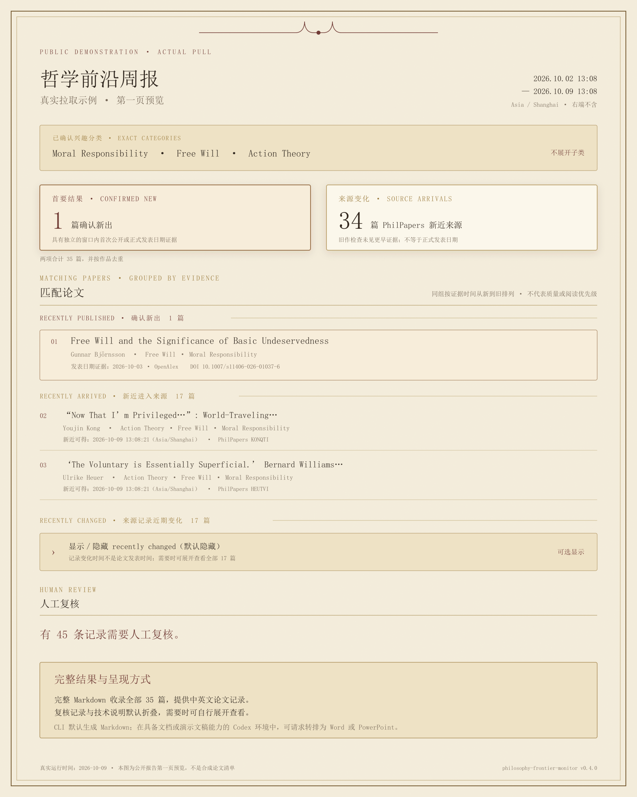

# Philosophy Frontier Monitor

[English](README.en.md) | 简体中文

**按你确认的研究方向，持续生成事实性的哲学新论文周报。**

研究者用中文或英文说明研究方向，Skill 将其映射到经过核验的 PhilPapers 受控分类；只有用户
明确确认的分类才会进入监测。报告保留论文题目、作者、日期证据、命中分类、来源链接与覆盖缺口，
不评价论文质量，也不按模型评分删减结果。

现在也可按已确认的兴趣配置检索**已有论文**：`pfm search --config config/watchlist.yaml`。
它不限制为近期新作；只纳入有论文类型证据的记录，排除书籍、书章和书评。引用量有数据就降序
排列，缺失就标注并置后。支持临时选择已配置标签、年份范围、论文类型和结果分页，不修改订阅
或周报状态。当前覆盖分类 feed 本次返回的记录，不保证完整历史索引。
不限制年份时默认返回全部已确认匹配论文，缺少 feed 日期或年份提示也不排除；只有设置年份
范围时，才提前排除没有 feed 年份提示的记录。用户明确指定数量时仍可分页。
[检索用法、范围与缺失说明](references/paper-search.md)。


[查看完整公开示例周报](examples/public-demo-weekly-report.md) ·
[查看周报预览原图](assets/demo/public-demo-weekly-report-2026-10-09.png) ·
[完整安装说明](references/installation.md)

### 公开示例：用三个真实标签实际拉取

**示例状态（2026-10-09）：**本次在北京时间 10 月 9 日 13:08 运行七日 `pull-now`，窗口为
10 月 2 日 13:08 至 10 月 9 日 13:08（右端不含）。选用完整 PhilPapers taxonomy 中的
`Moral Responsibility`（4590）、`Free Will`（347）和 `Action Theory`（5992），均按精确分类读取，
不展开子类。三个分类的官方 RSS 均成功读取，报告来自真实运行，不是合成稿。

**确认新出 1 篇**，另有 **PhilPapers 新近来源 34 篇**，合计 35 篇去重后的匹配作品。
“新近来源”表示作品进入所选分类的 PhilPapers／PhilArchive 来源变化集合，且本次旧作检查未见
更早作品证据；它不等于取得正式发表日期。完整报告将 35 篇依次分为
**recently published**（1 篇）、**recently arrived**（17 篇）与
**recently changed**（17 篇）。各组按相应证据时间从新到旧排列；来源记录变化组默认折叠，
保留可见的显示／隐藏开关。另有 **45 条记录需要人工复核**。

下图呈现本次报告第一页。[完整 Markdown](examples/public-demo-weekly-report.md)保留全部 35 篇的
中英文记录，以及可展开的复核记录和技术说明。[2026-09-09 旧版快照](examples/public-demo-weekly-report-2026-09-09.md)
仍可查阅。即时模式不推进正式周报状态。



<details>
<summary>查看本次拉取的覆盖与核验限制</summary>

三个分类的官方 RSS 各返回 500 条；程序读完了这些返回内容，但恰好 500 条不能证明来源没有
条数上限，也不能证明当前 RSS 覆盖了七日内全部作品。PhilArchive OAI 在本窗口内返回 148,183 条
来源事件，主要为记录变化，不能当作新发表论文。OpenAlex 书目核验遇到限额与请求失败，
19 条候选等待后续自动重试；还有 45 条需人工复核，均未计入 35 篇匹配结果。
本示例未启用知网、万方，也未实时巡查中文期刊原站。完整的来源状态和证据边界见报告末尾。

</details>

CLI 原生报告格式是 Markdown。若当前 Codex 环境具备文档或演示文稿生成能力，用户还可以要求把
同一份报告转排为 **Word（.docx）** 或 **PowerPoint（.pptx）**；这是报告生成后的呈现转换，不会
重新筛选论文，也不是 `pfm` CLI 的原生导出格式。交互式 Markdown 中可以直接点击展开；若准备
转排 Word 或 PowerPoint，并希望其中包含来源记录变化组，可在生成时加入
`--show-recently-changed`，使该组默认展开。

### 为什么它不同

- **研究范围由你决定**：自然语言兴趣先映射为真实分类，再由你逐项确认；
- **完整报告而非质量排名**：不按作者声望、期刊等级、引用量或模型评价过滤；
- **证据与缺口同时披露**：区分出版、新近可得、来源重录和元数据更新，来源失败不会伪装成零结果；
- **私人配置留在本机**：研究方向、凭据、SQLite 状态、缓存与周报默认不进入公开仓库。

### 开始安装

需要 Codex、Git、[`uv`](https://docs.astral.sh/uv/) 和 Python 3.12 或 3.13。在 Codex 中调用：

```text
$skill-installer 请从 https://github.com/AsahinaMafuyu0127/philosophy-frontier-monitor
仓库根目录安装这个 Skill；path 使用 .，安装名称使用 philosophy-frontier-monitor。
```

安装后，在新一轮对话中说：

```text
请使用 $philosophy-frontier-monitor，帮我把研究方向映射到经过核验的 PhilPapers 分类，
由我确认后完成本地配置、历史基线和第一次周报。不要让我把凭据粘贴到聊天中。
```

最近发布的应用版本标签为 **v0.4.0**；内部证据管线版本为 **0.6.0**。正式实机验收在 Windows 上完成；
macOS／Linux 路径已经兼容，但尚未取得同等的真实定时运行验证。

<a id="technical-update-2026-10-09-official-rss-link"></a>

## 技术更新：官方 RSS 直读与公开周报刷新（2026-10-09）

本机分类页的命令行 HTTP 403 确认为 Cloudflare 安全验证。经用户在正常浏览器完成页面验证后，
三个分类均由各自页面控件生成官方 RSS 链接；私人 watchlist 的可选 `official_rss_url` 经过域名、
分类身份与未筛选参数核对，可直接读取这些链接，原有证据规则不变。隔离七日 `pull-now` 实际完成，
报告列出 1 篇确认新出、34 篇新近来源，45 条需人工复核。来源覆盖、未完成核验与上游限制
保留在报告的可选展开说明中；正式周报状态未推进。433 项测试、Ruff、Skill 校验和只读发布检查通过。
来源与方法见[完整公开报告](examples/public-demo-weekly-report.md)及[来源目录](references/source-catalog.md#2026-10-09-访问复核)。
本次为分支文档与示例更新，未创建新版本标签或 GitHub Release。

<a id="technical-update-2026-10-08-public-demo-refresh"></a>

## 技术更新：公开示例刷新状态（2026-10-08）

按原有三个公开分类与七日窗口在隔离配置中重试 `pull-now`，PhilPapers 分类页返回 HTTP 403；另以 `pfm feed` 独立核查，结果相同。两次请求都没有生成新报告，正式周报状态未推进。介绍页现明确标注 2026-09-09 成功快照的日期和本次更新未完成的事实，避免读者将旧统计误读为当前窗口。保留原报告及预览图，不改论文记录。此项为分支上的说明更新，未创建新版本标签或 GitHub Release。

<a id="technical-update-2026-10-08-v040-release"></a>

## 技术更新：v0.4.0 正式发布（2026-10-08）

本次发布将已通过[中文期刊稳定化验收](references/chinese-journal-stabilization.md)的有界线索服务、
三模式刊方日期补证，以及周报来源状态与去重覆盖修正纳入 `v0.4.0`。应用版本元数据和
`uv.lock` 已同步；内部证据管线仍为 `0.6.0`。中文题录与期次继续作为单列候选，只有出版月份
有证据且与窗口相交的线索进入周报或即时拉取；逐篇“已确认新论文”、十五刊全自动覆盖、
全库召回率和固定到达时限均不在本次承诺内。安装包与最终验收记录见
[发布验收记录](references/v0.4-release-candidate.md)。发布检查现能正确排除 Git 链接工作树的
`.git` 指针文件；422 项测试、Ruff、Skill 校验、只读发布检查与锁定依赖安装已通过，源码包和
wheel 的必需文件及私人路径边界已核对，wheel 已在新环境安装并验证命令入口。本条对应
`v0.4.0` 标签与 GitHub Release。公开 `v0.3.0` 状态库的 schema 4 升至本版的 schema 6 前
会生成经完整性核验的备份；升级步骤见[安装指南](references/installation.md#升级至-v040-的核查)。

<a id="technical-update-2026-10-07-weekly-coverage"></a>

## 技术更新：周报来源状态与去重覆盖说明（2026-10-07）

正式周报把本地已复核刊方期次的 `local_only` 与来源失败分开：当已检查的网络来源成功、
但本地官方期次本周没有新增时，不再误写“至少一个来源未成功检查”。知网与万方的
中文期刊覆盖说明增加“先前已列”的去重数量，使候选总数、缺月、窗外和本周正文条目
可以核对；已列期次仍不会重复呈现。对已成功生成报告的文字更正使用私人备份，
不重跑窗口或推进检查点。420 项测试、Ruff、Skill 校验与只读发布检查通过；
本项为本地代码与文档更新，未推送或创建版本标签、GitHub Release。

<a id="technical-update-2026-09-28-weekly-months"></a>

## 技术更新：中文期刊三模式日期补证与周报顺序（2026-09-28）

正式周报的完整中文与英文部分均先列中文刊方、知网及万方线索，再列 PhilPapers 论文。
知网期次的首次扫描基线也必须通过月份门槛：只有出版月份有证据且与周窗口相交的期次才列
相关题名；较早期次、缺月和日期冲突分别计入覆盖，不用期号、检索日或公告日推算月份。
刊方仅有公告日的期次不能据此进入正式周报；明示期次月份与提前刊出日仍分别保留。

知网缺日期时，可先用 `scripts/prepare_weekly_cnki.py --config config/watchlist.yaml` 只读
获取有限候选，再到同篇、同期的期刊主站核实。脚本默认准备周报，也支持
`--mode pull-now --days N` 与 `--mode search --year-from YYYY --year-to YYYY`；
三个模式共享补证逻辑，期次与逐篇字段保持一致。检索的 JSON 与 Markdown 展示核实日期、
原站链接及缺月／冲突状态，历史候选继续服从指定年份范围。私人逐篇核对文件新增可选
`issue_label_month` 和 `publication_date`，只有书目字段完整相符的刊方页面可以补证；
目录记录不能补出版日期。月份筛选先于逐篇万方查询。以往缺月的观察后来取得证据仍可列入
合格窗口；补跑旧窗口不会提前消耗未来刊期，已列期次继续去重。详见
[中文来源政策](references/chinese-source-expansion.md#43-月份精度与新期次观察)。

419 项测试与 Ruff 检查通过，覆盖基线筛选、窗外与缺月排除、书目冲突、日期格式、提前发行、
后续补证、未来窗口保留、中英文顺序，以及同一刊方证据在检索和即时模式间的复用、年份范围
和正式状态只读。程序读取已人工核实的日期，候选准备脚本不自动判断
官网日期，也不证明中文候选在本周首次发表或已完成兴趣匹配。本项为本地代码与文档更新，
未推送，未创建版本标签或 GitHub Release。

<a id="technical-update-2026-09-28-journal-p2"></a>

## 技术更新：第九个刊方目录与同篇到达证据收紧（2026-09-28）

稳定性判定：经过[中文期刊稳定化验收](references/chinese-journal-stabilization.md)，**有界中文线索服务**在本次 `main` 分支更新中列为显式启用的稳定功能。`search` 提供带来源的中文题录候选，`pull-now` 只显示有明确月份且与近月窗口相交的线索，`weekly-run` 对已复核新期建基线、去重并披露来源故障。刊方自动目录仍须人工核实后才能进入这三种模式；中文候选不自动成为“已确认新发表论文”。公开示例默认关闭中文来源。此判定不承诺完整覆盖、固定数据库到达时限或研究兴趣论文召回率；本次代码推送不创建新版本标签或 GitHub Release。

新增[《孔子研究》主办方栏目](https://www.chinakongzi.org/category/kongziyanjiu_qikan/)的有界文字目录采集：只读取栏目索引和最新一期的[官网目录页](https://www.chinakongzi.org/content/6147_589032.html)，核对期号、15 条作者题名及页面后段逐篇标题。目录页的 2026-08-13 是官网公告日，系统保存为待核线索；该页未明示期次月份，不能从“第 4 期”推算月份或把其中论文称为八月新发表。由此，十五种登记期刊中已有九种可独立巡检（八种文字目录、一种 PDF），另外六种仍按站点人工核查。

同篇到达汇总现在只使用已保存查询范围、且标为完整查询的 `miss` 作为“最后一次完整未命中”。旧观察库里没有范围的未命中，以及截断查询，不会再形成看似精确的到达区间；原始观察行保留不变。逐期 `audit` 新增 `complete_misses`，使完整未命中与原始状态计数分开。[逐篇观察说明](references/publisher-article-observation.md)写明了核算口径与剩余站点状态。

P2 的逐期审计进一步区分刊方完整目录记录、人工确认的研究论文、人工确认的兴趣相关论文三个分母。作品类型或兴趣仍有未核、存疑时，较窄分母保持未知；来源可见性只有在该期所有研究论文都经过有范围的完整查询时才有可比较分母。`journal-watch catalog` 现明确标示每刊目录为 `automatic` 或 `manual`。对未自动采集的六刊完成[逐站入口审查](references/publisher-article-observation.md#2026-09-28-六站入口复核与自动采集决定)：《中国社会科学》官网有按期栏目及第 8 期公众号目录提示，但本机直连与使用边界尚不能支持自动采集；《伦理学研究》直连返回 502，《宗教学研究》逐篇目录为图片，其余三刊当前登记入口缺少当期刊方完整目次。六刊继续保留人工核对，未采集不表示无新刊。[来源使用说明](THIRD_PARTY_NOTICES.md#中文期刊发布渠道及补充检索)列出访问、频率、保存字段与公开范围，万方仍默认关闭。

2026-09-28 新建 Git 忽略的隔离库完成九站各一期巡检，共 132 条目录记录，九站均成功，默认没有逐篇数据库查询。首轮仅对《孔子研究》抽查 1 篇，知网公共检索面完整标题查询命中。随后在隔离副本显式开启一次万方 Query，对另一篇的双来源核对得到知网完整命中、万方完整未命中，两边各 1/1 页。该篇刊方作者姓名内的空格曾被误拆，现已修正并回归；合计只核对该刊两篇，其他 13 篇和其余刊物在本轮未核对。万方仍默认关闭，样本不支持全库召回率、全库漏收或固定收录时限结论。402 项测试、Ruff、Skill 校验和只读发布检查通过。本次作为 `main` 分支代码与文档更新，不创建新标签或 GitHub Release。

<a id="technical-update-2026-09-27-journal-p2"></a>

## 技术更新：中文期刊逐期分母与第八个刊方目录（2026-09-27）

在已验收的 P0/P1 中文线索工作上，新增 `pfm journal-watch audit`：只有一次整期采集通过本站页数、条数核验，且本地题名仍与该次扫描一致，才显示刊方目录记录数这一参考分母；旧库和截断结果保持未知。逐篇审计同时记录知网公共检索面、可选万方 Query 的最后核对状态、检索范围及实际取得的页数。`classify` 允许人工依据登记的原站链接分别判断作品类型和与本地研究兴趣的关系；未核实记录不自动算成研究论文或兴趣论文。该审计库不改变检索、即时拉取和周报中的已匹配论文判定。

自动刊方入口由七种文字目录扩至八种：新增[中山大学《现代哲学》官网目录](https://mphilosophy.sysu.edu.cn/cat/124)的有界 PDF 解析。其[2026 年第 2 期公告页](https://mphilosophy.sysu.edu.cn/article/25746)标为 6 月 29 日发布，所附中文目录 PDF 明示“三月号”；系统把期次月份与网页公告日保存为两个独立待核证据链接，不将网页发布日期当作论文首发日。PDF 须通过登记 HTTPS 主机、大小、页数、内容类型、文件头及期次条数核对，仅在内存解析，不保存原文件；其余七个登记入口继续逐站人工复核。

2026-09-27 在 Git 忽略的隔离库中，八刊各一整期共取得 117 条刊方目录记录，默认巡检未查询数据库；另以每站一篇的额度对知网公共检索面作八次完整标题核对，八次均命中。其余 109 条未在该轮核对，万方未开启，117 条也未完成论文类型与兴趣的逐篇人工核实。这组结果不构成全库召回率或到达时间结论。398 项测试、Ruff、Skill 校验及只读发布检查通过。实现细节、人工复核命令及使用边界见[逐篇观察说明](references/publisher-article-observation.md)和[稳定化验收](references/chinese-journal-stabilization.md)。本次为本地分支更新，尚未推送、创建版本标签或发布 Release。

<a id="technical-update-2026-09-27-official-journals"></a>

## 技术更新：刊方目录逐篇采集与到达区间观察（2026-09-27）

已完成[中文期刊稳定化验收](references/chinese-journal-stabilization.md)中的 P0/P1 有界线索工作：独立检索现在会在本地刊方证据库读取失败时标明来源故障并继续；自动目录可通过 `pfm journal-watch pending` 查看，在核对原站后使用 `review --confirm-evidence` 提升为已复核期次。自动读到的公告日也先待核，原始所见时间与核实时间分开保存，重扫不会撤销核实；同一期多个官方链接在用户报告中只计一条，周报按首次核实周报告。隔离配置的三模式测试覆盖启用、关闭、近月窗口、周报基线及去重，来源错误测试覆盖限流、非 HTML、重定向、分页截断与单站失败。新建隔离库的真实试跑在《哲学研究》门户取得第 8 期 12 条目录记录（仍待核），在[《周易研究》官网目录](https://zhouyi.sdu.edu.cn/info/1033/2558.htm)取得第 4 期 11 条；核对官网明示的 2026-08-21 公告日后，仅在隔离库复核该期。这个日期不代表逐篇首次发表日。中文题录候选仍与已匹配论文分栏，逐篇确认及全部中文期刊覆盖尚未完成。本次为未推送的本地分支更新，未发布版本标签或 Release。

本次最终验证为 391 项测试、Ruff、skill 校验及只读发布检查通过。真实来源试跑只覆盖上述两站；没有对七站的长期可用性或全部中文哲学论文的召回做出保证。

已更正[中文来源政策](references/chinese-source-expansion.md)中早期“《哲学动态》门户仅到第 7 期、目录尚未自动采集”的过时记录：本次七站实采时门户为第 8 期，公众号第 9 期仍待读取原帖核实。此更正不把自动目录记录直接升级为已复核论文。

新增[中文期刊稳定化验收](references/chinese-journal-stabilization.md)：分别规定可先行验收的中文候选线索服务与尚未完成的“已确认新论文”服务，列出新安装三模式闭环、刊方证据复核、来源故障降级及覆盖抽样的通过条件。八周同篇观察只提供来源到达证据，不作为整套功能的唯一稳定门槛。本次仍为未推送的分支更新。

已对七种可取得完整文字目次的期刊建立有界逐站采集：《自然辩证法通讯》《周易研究》《哲学研究》《哲学动态》《哲学分析》《自然辩证法研究》《科学技术哲学研究》。`pfm journal-watch run` 顺序扫描全部七站，默认只巡检刊方目录；显式设置逐篇篇数后才核对知网公开检索面，万方授权 Query 还须显式使用 `--with-wanfang`。逐篇核对有每日总篇数及每站篇数双重上限，一站失败不会中断其余站点。每次结果存入 Git 忽略的本地库。目录巡检为新期提供线索；重复查询同篇的到达观察是可选的来源评估，其他用户直接使用检索、即时拉取或周报时无需先建立观察基线。完整未命中后首次同篇命中只能形成检索可见到达区间，首次即命中和持续未命中分别为左删失与右删失证据，均不能证明数据库全库漏收。

七站最新一期实采分别取得 14、11、12、12、16、17、18 条有作者的目录记录，合计 100 条。原有三站首轮各核对 5 条，新增四站首轮各核对 1 条；这 19 条在知网公开检索面均命中，先前显式开展的万方精确题名查询命中 2 条、未命中 17 条。它们是本次有界样本，不是总体漏检率。当前同篇复查先设约八周的阶段性评估节点，万方延迟研究仅在显式启用后另行确定范围。《哲学动态》编辑部门户仍显示第 8 期；用户提供的第 9 期公众号链接因正文未能读取，继续保留为待核线索，不能因门户尚未更新而否定新期。其余八个已登记入口保留逐站人工复核状态。379 项测试与 Ruff、只读发布检查通过；尚无跨日到达区间统计。用法、证据与各站限制见[刊方目录逐篇观察](references/publisher-article-observation.md)。本次未推送、未创建版本标签或 Release。

## 技术更新：重点期刊官方渠道优先的期次监控库（2026-09-27）

中文期刊的期次与日期现在优先核对编辑部或主办单位的官网、正式期刊门户和已核实的
官方公众号；知网空间、万方用于补充发现与书目交叉核对。新增
[15 种期刊的官方入口目录](config/official-journals.yaml)与 Git 忽略的本地期次
证据库。`pfm journal-watch catalog` 可查看目录；`pfm journal-watch list` 可查看本地
观察。人工录入须附官方证据 URL，并把期次标示月份、刊出日、公告日和首次观察时间
分开保存。只有 `reviewed` 记录才进入检索、即时拉取与周报的期次线索；已复核的
官方月份还可补足同刊同年同期且缺月的知网题录，不会覆盖相互冲突的原始月份。
周报只在期次首次核实发生的那一周提及，避免同一个月重复报告同一期。

《哲学动态》门户标明月刊，但本次无法读取用户提供的第 9 期
[公众号原帖](https://mp.weixin.qq.com/s/eeYI8s6Y_f9J3zbJ73XgSg)正文，故该链接只作为
`pending` 线索，暂不推断发布日期或九月标示月份。另查到《哲学研究》杂志社公布的
2026 年出版计划：该刊拟每月 25 日出版，
《世界哲学》拟单月 2 日出版；计划日期不作为某期实际刊出日。
当前库仍依赖人工核对各刊期次，尚未自动逐站采集目录或核实逐篇论文的兴趣匹配；
官方期次线索不会计入已核验新论文。
已在本机验证目录命令返回 15 刊、私人库录入与读取、368 项测试、Ruff 检查、
skill 校验和发布检查；没有对各期刊实施连续自动巡查。
本次为本地分支更新，未推送、未创建版本标签或 GitHub Release。
详见[中文来源与录入门槛](references/chinese-source-expansion.md#24-官方期刊监控库与证据录入)。

<a id="technical-update-2026-09-27-audit"></a>

## 技术更新：重点期刊原站目录的月份核对基线（2026-09-27）

建立了本地、Git 忽略的重点期刊目录抽样审计：按原站的期次和月份证据，逐篇核对
知网空间与现有个人订阅万方 Query 的题录，并记录本次观察时间。八篇有界样本中，
知网空间均找到但均缺显式月份；万方三篇完全同题、一篇带副题名差异，另四篇
在本次有界查询中未核对到。两篇原站明确标为九月的文章，即使另被私人检索词
发现，仍无法凭现有知网题录通过近月月份门槛；本次未测私人词表对此样本的召回。
未命中不等于数据库全库未收录；一次快照也
不能推算真实收录延迟。另一区别是期刊原站“刊出日期”与万方“文摘上网日期”
不能混写为逐篇首次发表日。

[来源证据与试验决策](references/chinese-source-expansion.md#23-重点期刊原站目录的月份证据与抽样基线)
记录了可复核的原站链接、访问限制和月份语义。现阶段暂不扩大为跨期刊自动来源；
优先考虑对有明确月份的固定期次目录作窄范围试验，待连续复查后再决定扩展。
本次为分支内审计与文档更新，未创建版本标签或 GitHub Release，也未推送。

<a id="technical-update-2026-09-23"></a>

## 技术更新：个人订阅下的万方独立发现（2026-09-27）

中文期刊补充来源新增可选的**万方独立题录发现**：使用用户现有 AI HUB Query 订阅，
按私人中文检索词、年份和最多两页的明确上限查 `OpenPeriodicalChi`，不再要求论文先被
知网空间搜到。独立检索单列候选；即时拉取仅列万方标示出版月份与滚动窗口相交的候选；
周报首次建立窗口内万方记录 ID 基线，以后只提示此前未列入窗口、且月份与该窗口相交的记录。
同一期后来出现新记录 ID 时也能形成观察线索。开关 `sources.wanfang.discover` 默认关闭，
可在私人 watchlist 中启用，默认每次至多两个词、每词每年一页；它会使用个人订阅的请求额度。
配置和来源边界见[中文论文来源扩展](references/chinese-source-expansion.md)。

2026-09-27 以通用词、有限请求实测了现有订阅的限定年份检索和出版时间排序。
万方题录同时出现“第 4 期”却写 1 月 1 日、以及晚于检索日的出版时间标示；因此程序
不把 `PublishDate` 当作逐篇首次发表日，1 月 1 日形式也不作为可靠月份证据。
中文候选继续与已核验 PhilPapers 论文分栏；知网空间与万方均是有界检索，截断和失败
单独披露，不能承诺全库覆盖。Crossref、DOAJ 和期刊原站可作后续补充，但各有收录或
访问范围，尚无免授权且可证明覆盖全部中文哲学期刊的单一替代源。新增独立发现、日期
占位、近月过滤及周报 ID 增量回归测试；本次分支更新没有创建新标签或 Release。

## 技术更新：知网空间候选与中文期刊期次观察（2026-09-23）

本次分支更新将**PhilPapers 全球候选与中文数据库补充候选**作为长期目标，不按作者机构过滤
既有 PhilPapers 结果。在私人 watchlist 中可选择开启 `sources.cnki_space`，用经用户认可的
中文检索词进行有页数上限的知网空间题录检索。项目借鉴第三方
[cnki-search MCP](https://github.com/Biogod2020/cnki-search) 的公开检索方法，以普通 HTTP 客户端
实现独立适配层，不运行第三方服务端或模拟浏览器。配置格式与证据口径见
[中文论文来源扩展说明](references/chinese-source-expansion.md)。

三个模式现在均可显示中文来源线索：`search` 单列未经逐篇核验的中文题录，不计入已确认论文
总数和引用量排序；`pull-now` 只读展示有明确月份证据、且月份与所选滚动窗口相交的期次；周报首次扫描建立期次基线，之后只
显示此前未见的期次，并将观察与周报状态一起提交。报告保留来源给出的年份、期号和首次观察
时间；“第 9 期”不自动解释为“9 月刊”，题录中的日级时间也不自动解释为论文首次发表日期。
网络受阻、结果结构异常或页数截断会显示为覆盖限制，不被解释为没有相关论文。

此次新增最小无凭据的 HTML 夹具，验证了题录解析、错误页、内容类型、分页中断与状态事务；
也以有限的公开检索试跑了已配置的私人术语。中文候选仍需逐篇核对期刊原站及发表时作者机构，
万方的少量候选随后已作书目核对，系统性的跨库核验与维普核对仍未完成；中文题录未合并进已核验论文主栏。知网空间不是完整 KNS，有限页
检索不能承诺覆盖中国或世界的全部论文。没有创建新版本标签或 GitHub Release。

随后接入 Git 忽略的私人逐篇证据文件：人工在期刊或目录页面核对题名、作者、刊名、年份与期次，
有逐篇机构证据时才标出中国机构署名；冲突或缺字段保持待核验。两条私人候选已分别据期刊逐篇
发布门户页面和另一目录页面核对书目字段，其中前者还支持中国机构署名；该发布门户由知网承载，
不等于万方或维普的独立复核。检索及周报会提示本次
已解析 PhilPapers 记录中的严格书目重合
线索，但不自动合并或改变已核验论文数量。国家哲学社会科学文献中心用户协议限制未经许可的
自动抓取；万方已展示试用订阅接口、维普的正式自动核验接口尚未获得授权。新增合成夹具验证相符、冲突、缺字段与
重合提示。具体格式和边界见[中文论文来源扩展说明](references/chinese-source-expansion.md)。

本次又接入可选的万方 AI HUB 题录交叉核对。用户已展示“万方文献检索”订阅页及 Query 接口说明；
配置启用后，程序只从本机环境变量 `WFDATA_APP_KEY` 或 Git 忽略的私人密钥文件读取 AppKey，
以有限条数和页数查询中文期刊题录，
比较知网候选的题名、作者、刊名、年份及期次，并在三种报告中标示相符、缺字段、冲突或未核对。
万方的 `OriginalOrganization` 是发文时机构线索，但程序尚不据此自动认定哪位作者属于中国机构；
无同题命中也不推断万方未收录。新增合成 JSON 夹具验证请求、字段结构、错误响应和分页截断；
本机已用试用订阅完成有限真实请求及知网候选的逐篇核对。实际响应把数字命中数编码为字符串，
将期刊题录放在 `Periodical` 对象中；解析器现兼容该结构，并在 `PublishYear` 为 0 时从
`PublishDate` 提取年份。私人检索结果与 AppKey 未进入公开文件。试用额度、长期稳定性和全库覆盖仍未核实。

本次还按用户要求收紧即时拉取的中文栏：不再把当年检出的期次全部列入最近一个月报告。
只有来源明确标示的卷期月份与所选滚动窗口相交，相关论文线索才显示；仅有年份或期号、
以及月份在窗口外的记录只计入覆盖统计，不显示题名。万方即时核对仅针对显示的线索。
月精度不能证明逐篇论文在窗口内首次发表；中文栏为空也不等于近月没有中文论文，用户可另行
要求扩大范围。历史 `search` 和正式周报的既有口径不变。已用合成跨月、缺月与窗外期次
验证过滤和报告呈现；没有创建新版本标签或 GitHub Release。

<a id="technical-update-2026-09-20"></a>

## 技术更新：公开示例的人工复核提示（2026-09-20）

公开示例的覆盖说明现在只显示“有 18 条记录需要人工复核”，中英文介绍页与预览图同步调整。
完整示例的复核明细和技术说明默认折叠，读者可自行展开；原有论文记录及核验事实保留。
本次为文档与展示更新，已核对论文内容、折叠结构和链接，并重新渲染检查预览图。

<a id="technical-update-2026-09-19"></a>

## 技术更新：兴趣论文检索与当地时间调度（2026-09-19）

本次 `main` 分支更新新增独立的 `pfm search`，按已确认的兴趣配置与 PhilPapers feed 标签查找
已有论文，支持任一／全部标签匹配、年份与论文类型筛选。检索不要求历史基线，也不推进周报
通知历史或改写长期订阅。此功能已随[代码提交 `9249da6`](https://github.com/AsahinaMafuyu0127/philosophy-frontier-monitor/commit/9249da600c79a63c2f55a973bcd98c60cd2361dd)
推送，尚未另建版本标签或 GitHub Release。

日期处理按用户的检索要求区分：**不限制年份时**，缺少 feed 日期、年份提示或正式发表日期的
论文仍可纳入，默认返回全部已确认匹配结果；只有用户明确限量时才分页。**指定年份范围时**，
没有 feed 年份提示的记录在书目查询前直接排除，最终年份筛选仍使用正式书目日期证据。

引用量采用 OpenAlex 的可用计数，已知值降序排列，缺失标注并置后，零次引用与缺失分开处理。
书籍、书章、书评等非论文形式不进入结果；类型或书目身份未确认的记录只提示存在、不报告
数量，并可提供已有来源供用户自愿核对，skill 不再为这些记录追加调查。冲突 DOI 不会因仅有
一个外部匹配就被视为身份已确认。

定时任务流程现在优先读取会话提供的用户时区，缺少时检测本机时区；“早上八点”等表达按当地
时间理解，在最终创建任务时统一确认星期、时间和时区，不在前期单独追问。既有订阅仍沿用其
已确认的时区。

功能提交通过 **319 项测试**、代码与格式检查、skill 校验及发布检查。Git 历史备份包也已纳入
私人文件保护。检索覆盖本次分类 feed 能够提供并确认的论文，不代表 PhilPapers 全站完整书目。
完整规则见[论文检索说明](references/paper-search.md)与[变更记录](CHANGELOG.md)。

今后的项目更新都会同步写入本页及英文页面的技术更新，并保留已有记录；这一要求已写入
[维护规则](CONTRIBUTING.md#网页技术更新与变更记录)。

## 技术更新：OAI 跨运行缓存与即时拉取收尾（2026-09-08）

证据管线 `0.6.0` 为 PhilArchive OAI 增量收割增加了可中断恢复的跨运行 SQLite 缓存。`pull-now`、
`weekly-run` 和 `catch-up` 默认复用已经完整收割的 OAI 窗口，只从网络补齐尚未覆盖的区间；可用
`--no-oai-cache` 临时关闭。缓存位于 Git 忽略的私人 `var/oai-cache.sqlite3`，与周报通知、基线和
检查点状态分离。

OAI 缓存只保留记录标识符、来源 `datestamp`、删除标记，以及程序实际使用的 `dc:identifier`、
`dc:date` 和 `dc:type`；不保存题名、作者、摘要或全文。缓存命中仍会重新执行当前窗口过滤、作品
类型处理和确认分类交集，不会因为此前见过某条记录而抑制本次即时报告或后续周报。

PhilArchive 当前提供秒级 OAI `datestamp`。收割器现在向前重叠一个秒级单位，并把 OAI 的包含式
`until` 精确转换为本地半开窗口 `[start, end)`，避免额外下载窗口结束日的无关记录。长冷启动会在
stderr 报告已完成分页数和累计记录数。每个成功页的最小记录和下一枚不透明 `resumptionToken`
在同一事务中落盘；中断后续跑从最近检查点继续。只有全部分页成功且暂存记录原子并入正式缓存后，
程序才把区间登记为已覆盖；过期或被上游拒绝的令牌会安全清空该缺口的暂存并从原窗口重新收割。

即时拉取的范围保持克制：成功 OAI 窗口未命中的完全无日期记录从本次滚动候选集移除；已经命中
OAI、但同时缺少 feed 时间、书目年份、DOI 和明确手稿／预印本类型的库存记录，进入私人、只含
来源 ID 散列的“日期证据不足集合”。普通拉取只提示集合数量，不逐条消耗书目查询，也不把它们
计入机器积压或人工复核；若后来出现任一上述证据，记录自动返回核验。这不是旧作或不相关判断，
也意味着完全缺少这些信号的新手稿可能不会出现在普通即时报告中。项目不为这部分记录增加付费墙
页面或逐篇 PhilPapers 抓取。`pull-now` 自 `v0.3.0` 起属于稳定
功能；它与每周监测共享证据标准，但仍是用户主动调用、只读且不推进通知历史的独立模式。完整规则见 [CHANGELOG.md](CHANGELOG.md)、
[监测政策](references/monitoring-policy.md)与[结构化作品类型政策](references/work-type-policy.md)。

## 一、旨在解决的问题

哲学研究者往往需要反复打开 PhilPapers、期刊页面和书目数据库，检查自己的研究领域是否出现了
新论文。本项目把这项机械劳动转化为持续监测：研究者用中文或英文说明研究方向，Skill 将其映射
到经过核验的 PhilPapers 受控分类，并在新论文命中已确认分类时生成周报。

它不评价论文质量，不替研究者判断论证是否成功，也不按作者声望、期刊等级、引用量或模型评分
删减结果。它要解决的是“不要漏掉可能相关的新论文”，而不是“替我决定哪些论文值得读”。

## 二、功能

公开 `v0.3.0` 的稳定功能包括：

- 把自然语言研究方向转换为待确认的 PhilPapers 分类集合；
- 只启用用户确认过的真实分类，不把模型生成的关键词冒充官方分类；
- 首次运行先建立历史基线，避免把既有论文误报为本周新作；
- 按用户时区执行每周增量监测，并在错过计划时间后按窗口顺序补跑；
- 区分正式发表、预印本／手稿新近可得、来源重新收录和元数据更新；
- 合并多个分类来源中的同一作品，并抑制正式周报中的重复通知；
- 输出题目、作者、载体、日期证据、命中分类、来源和稳定链接；
- 没有匹配结果时如实报告零结果，来源失败时明确说明覆盖缺口；
- 在 1—31 个当地日的滚动窗口内即时拉取，并在中断后从 OAI 分页检查点恢复。

核心规则是：

```text
(确认在窗口内新出，或确认新近进入 PhilPapers 提醒流)
AND
(论文分类集合 ∩ 用户已确认兴趣分类集合 ≠ ∅)
```

`pull-now` 可以在用户明确提出时立即检查最近 1—31 个当地日，属于稳定但非定时、非通知模式。程序综合使用
PhilPapers 分类 feed、PhilArchive OAI 来源记录变化、Crossref／OpenAlex 书目证据、结构化作品类型
和用户已经确认的分类交集；OAI `datestamp` 始终只表示元数据记录创建、更新或删除，不等于论文
出版日期。

默认的私人 `oai-cache.sqlite3` 跨次保存已经完整收割的 OAI 窗口；相同窗口可以完全从缓存读取，
滚动窗口通常只需刷新新增尾部。缓存不属于周报状态，也不会抑制以后报告。首次遇到上游批量元数据
更新时，冷启动仍可能需要较长时间和较大的本地缓存；程序会显示分页进度、逐页保存恢复点，且只在
完整分页成功后登记覆盖。可用 `pfm oai-cache status` 检查记录数、覆盖与中断会话，用带明确
`--confirm` 的 `pfm oai-cache prune --before <ISO-8601>` 清理旧缓存；两者都不推进周报状态。

即时拉取开始时会显示磁盘建议。由于 OAI 和书目缓存可能在上游批量更新期间显著增长，Windows 用户
如有其他可用磁盘，应尽量不要把 `state_database` 及其同目录缓存放在空间紧张的 `C:` 系统盘；优先
配置到容量充足的非系统盘。该建议不改变跨平台路径支持，也不会擅自移动既有私人文件。

对完全没有 feed 时间、没有年份且未命中成功 OAI 窗口的记录，本项目不再继续扩展到付费墙或
非开放页面。若一条 OAI 库存记录连 feed 时间、书目年份、DOI 和明确早期稿本类型也都没有，默认
私人书目缓存只保存其来源 ID 散列，形成最长保留 365 天并随再次观察刷新的日期证据不足集合。
第一次拉取会在联网前提示运行可能较长，并以默认 300 条逐篇远程预算完成集合外候选的旧作核验；
集合内记录只报告数量。出现新证据时自动解除集合状态。OpenAlex／Crossref 的剩余延期、人工复核
和来源自动重试仍分别披露，不把未核验冒充已覆盖。稳定承诺指状态隔离、可恢复性、有界资源与诚实
报告，不表示固定运行时长，也不改变正式周报的通知历史、基线和检查点。

## 三、如何安装与首次使用

### 推荐：让 Codex 完成安装

需要 Codex、Git、[`uv`](https://docs.astral.sh/uv/) 和 Python 3.12 或 3.13。当前正式实机验收在
Windows 上完成；其他系统的路径已作兼容设计，但尚未获得同等的真实定时运行验证。

在 Codex 中调用内置安装器：

```text
$skill-installer 请从 https://github.com/AsahinaMafuyu0127/philosophy-frontier-monitor
仓库根目录安装这个 Skill；path 使用 .，安装名称使用 philosophy-frontier-monitor。
```

安装完成后的下一轮对话中，请 Codex 执行：

```text
请进入已安装的 philosophy-frontier-monitor 目录，运行 uv sync --python 3.12，
复制公开示例为私人 watchlist，并按照 Skill 引导我完成首次配置。
不要让我把任何 API key、密码或 Cookie 粘贴到聊天中。
```

Codex 官方文档说明，`$skill-installer` 可以从其他 GitHub 仓库安装 Skill；新安装的 Skill 通常在
下一轮对话可用，如果没有出现则重启 Codex。参见 [OpenAI 官方 Skill 文档](https://learn.chatgpt.com/zh-Hant/docs/build-skills)。

### 首次配置流程

1. 用普通语言告诉 Skill 你的研究方向；你不需要预先知道 PhilPapers 分类名称。
2. 审查 Skill 提出的真实分类、范围和推理理由，明确接受、拒绝或暂缓每个候选。
3. 按引导取得 PhilPapers taxonomy 所需的 API ID 和 API key，并只保存到本机 Git 忽略目录；
   不要把凭据发到聊天、Issue、截图或命令行参数中。
4. 建立历史基线。基线只把当前 feed 条目标为既有历史，不生成历史论文洪水。
5. 先完成一次 dry run 和正式周运行，再让 Codex建立每周计划任务。默认是用户当地星期一 08:00，
   可以改为其他时区、星期和时间。

熟悉终端的用户可以在安装目录中运行：

```powershell
uv sync --python 3.12
Copy-Item .\config\watchlist.example.yaml .\config\watchlist.yaml
.\.venv\Scripts\pfm.exe doctor
```

macOS／Linux 对应的程序路径是 `.venv/bin/pfm`。完整的安装、运行目录、凭据和首次基线说明见
[安装与首次部署](references/installation.md)；英文版见
[Installation and first deployment](references/installation.en.md) 与
[English user guide](references/usage.en.md)。

## 四、当前版本

最近发布的版本标签：`v0.4.0`。

| 能力 | 状态 |
|---|---|
| 自然语言研究方向到受控分类 | 稳定 |
| 分类范围预估与用户确认 | 稳定 |
| 历史基线 | 稳定 |
| 每周增量监测与事实性周报 | 稳定 |
| 错过窗口后的顺序补跑 | 稳定 |
| SQLite 状态、去重与事务性检查点 | 稳定 |
| 数据源有界重试、遥测与运行级熔断 | 稳定 |
| 用户主动即时拉取 `pull-now` | 稳定（主动、只读） |
| OAI 跨运行缓存、分页中断恢复与增量刷新 | 稳定 |
| 周报与即时报告的中英文双语输出 | 稳定 |
| 有界中文题录候选与已复核期次线索 | 稳定（自 `v0.4.0` 起；显式启用） |

**有界中文期刊线索是自 `v0.4.0` 起提供的可选稳定能力。**
开启 `sources.cnki_space` 后，检索、即时拉取和周报都能按各自窗口显示有界中文题录候选与已复核期次线索；公开示例默认不启用该来源。九种刊方目录可单独自动巡检（八种文字目录与一种 PDF），其余六种登记期刊仍需人工核查，自动目录记录也须先核实月份等证据才能进入三种模式。中文候选不计入已核验论文主栏，不承诺中文哲学论文的完整覆盖、固定到达时限或研究兴趣论文召回率。P0/P1 的范围明确线索工作及 P2 的逐期核算、入口处置与来源边界已验收；约八周的同篇复查仍是独立的来源评估实验，不妨碍普通用户使用上述有界能力。[中文来源与当前限制](references/chinese-source-expansion.md)

`v0.3.0` 将用户主动即时拉取纳入稳定能力。本版本完成分页暂存与 `resumptionToken` 检查点、进程
互斥、失效令牌安全重启、缓存状态和显式清理接口，并验证冷启动、中断续跑、热命中和滚动增量刷新。
本次未轮到远程核验／人工复核／自动重试继续分栏报告；稳定并不消除上游批量元数据更新造成的
冷启动成本。

OAI 缓存是性能与可恢复覆盖机制，不是论文新近性的替代证据。缓存命中不会把 `datestamp` 转换成
出版日期，也不会跳过当前兴趣分类、作品身份、作品类型或窗口判断。

### 设计来源、差异与本项目新增

本次 OAI 增量候选思路直接受到
[`sea9401/philosophy-mcp`](https://github.com/sea9401/philosophy-mcp) 的 `list_recent` 启发：当
PhilPapers RSS 没有条目时间时，改用 PhilArchive OAI 的记录变化窗口。不过，本项目没有复制其
代码，也没有沿用“只处理第一响应页”的实现，而是增加完整 `resumptionToken` 分页、重叠窗口与
精确本地过滤、删除记录处理、OAI 时间／出版时间分离、与确认分类 `/rec/` 集合求交、旧作检查和
失败回退。首次真实七日测试把 347 条宽候选缩为 47 条，真正需要用户判断的候选为 2 条。

我们也把 [`tamnd/philpapers-cli`](https://github.com/tamnd/philpapers-cli) 的无窗口、首响应页
`Recent` 实现，以及 [`Sfgangloff/co-philosopher`](https://github.com/Sfgangloff/co-philosopher)
的 RSS 年份／稿本状态提取作为对照，说明哪些办法不能单独解决“完全无时间信息”的问题。完整的
固定版本链接、许可证状态、没有复制上游代码的边界、逐项实现差异和仍然存在的覆盖限制见
[设计来源、实现差异与独立贡献](references/design-lineage.md)。

版本变化见 [CHANGELOG.md](CHANGELOG.md)，贡献和验证要求见 [CONTRIBUTING.md](CONTRIBUTING.md)。

## 五、安全与来源边界

- 私人研究方向、确认分类、凭据、SQLite 状态和周报默认只保存在本机，不进入公开仓库；
- `config/watchlist.yaml`、`var/`、`reports/`、`.env` 和虚拟环境均受 Git 忽略规则保护；
- `oai-cache.sqlite3` 与 `bibliography-cache.sqlite3` 都位于私人运行目录；OAI 缓存只保存标识符、
  记录时间、删除标记、最小类型／年份字段和中断续跑所需的不透明分页令牌，不保存题名、摘要、
  作者、全文或完整响应；书目缓存中的日期证据不足集合也只保存来源 ID 散列与首次／最近观察时间，
  不保存题名或作者；状态命令不回显令牌；
- API key 只允许从本机私人文件或进程环境读取，不写入代码、报告、日志、测试夹具或 URL 输出；
- 远程题目、摘要、XML、JSON 和错误页都按不可信数据处理，不能成为执行本地命令的指令；
- 默认不下载论文全文，不绕过付费墙、访问控制、TLS 验证或站点防护；
- 项目只监测用户确认的分类和运行时成功返回的来源，不承诺穷尽全球哲学新作或消除来源延迟；
- PhilPapers feed 到达时间不自动等于论文正式发表时间，报告会保留事件类型、日期精度和证据来源；
- OpenAlex 与 Crossref 用于书目身份、旧作和日期核验；它们的未收录或暂时失败不能被伪装成确定结论；
- MIT License 只适用于本项目代码，不自动适用于 PhilPapers taxonomy、第三方元数据、摘要或论文全文。

详细规则见 [安全与隐私政策](references/security-and-privacy.md)、
[监测政策](references/monitoring-policy.md)、[时间与版本语义](references/date-and-version-semantics.md)、
[数据源目录](references/source-catalog.md)与[第三方声明](THIRD_PARTY_NOTICES.md)。

## 六、问题反馈

- 维护者：**Asahina Mafuyu**
- 联系邮箱：[junxuanxie@stu.xjtu.edu.cn](mailto:junxuanxie@stu.xjtu.edu.cn)

普通安装问题、功能错误、来源兼容问题和改进建议，可以在
[GitHub Issues](https://github.com/AsahinaMafuyu0127/philosophy-frontier-monitor/issues) 中提交，也可以发送邮件。
反馈时请提供版本、操作系统、执行的命令以及已经删除私人信息的错误摘要；不要提交 API key、密码、
Cookie、私人研究方向、完整 `watchlist.yaml`、数据库、周报或带认证参数的 URL。

即时拉取问题还应说明窗口天数、`oai-cache status` 中的计数与布尔状态、是否发生中断，以及报告中
的本次远程核验未处理量／人工复核／自动重试数量；不要复制分页令牌或上传缓存数据库。维护者会
先把反馈归类为
可复现缺陷、来源语义变化、性能／资源问题或证据政策提案，再决定代码、测试或政策文档的修改。

可能导致凭据或私人研究数据泄露的安全问题，不要发到公开 Issue。请使用 GitHub Private
Vulnerability Reporting；具体步骤见 [SECURITY.md](SECURITY.md)。
